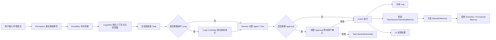

# CialloClaw 架构总览与开发路线

> 目标：为本地桌面 Agent 项目提供一套可直接开发、可持续扩展、可通过接口新增功能的架构蓝图。
>
> 本文档基于当前项目目标、现有目录设计，以及事件总线作为系统运行主干的思路整理而成。

---

## 1. 项目定位

CialloClaw 是一个**本地运行的桌面 Agent**，没有云端服务器，系统的核心能力包括：

- 感知用户输入与环境变化
- 理解上下文与识别意图
- 规划任务并分派给合适的 Agent / Tool
- 执行操作并在必要时请求用户确认
- 维护短期状态、长期记忆和审计日志
- 通过 TUI / 通知 / 交互式提示向用户反馈

因此，本项目的“API 设计”不应理解为 HTTP API，而应理解为：

1. **事件协议**：模块之间如何通过事件交互
2. **状态模型**：系统运行状态如何组织与持久化
3. **扩展接口**：如何新增感知源、Agent、Tool、中间件、记忆组件、UI 组件

---

## 2. 总体架构原则

### 2.1 分层原则

系统采用如下分层：

- **Perception（感知层）**：采集现实世界输入，产出原始事件
- **Cognition（认知层）**：聚合上下文、识别意图、规划任务、分配执行
- **Action（执行层）**：调用工具、请求审批、执行动作
- **State（状态层）**：维护会话、任务、循环、记忆、日志等状态
- **UI（表现层）**：展示结果、收集交互输入
- **Runtime（运行时层）**：事件总线、调度、Worker 池、生命周期管理

### 2.2 事件驱动原则

系统不是“一串硬编码调用链”，而是一个**事件不断推动状态演化**的系统。

- 各模块之间尽量不直接互相调用业务逻辑
- 模块通过“发布什么事件”和“订阅什么事件”协作
- 事件总线负责分发与横切处理，不负责承载业务状态

### 2.3 状态收敛原则

- **Event 是瞬时消息，不是持久状态**
- **Session 是运行时根对象**
- **Task 是业务工作单元**
- **Loop 是 Task 的迭代控制器**
- **Approval 是高风险动作的确认闸门**
- **Memory 是沉淀出来的长期可复用知识**
- **Log 是不可变事实流水**

### 2.4 扩展优先原则

新功能必须尽量通过以下方式接入，而不是修改主链路：

- 新增事件类型
- 新增订阅者
- 新增 Tool Provider
- 新增 Agent
- 新增 Middleware
- 新增 Memory Extractor
- 新增 UI 视图或交互组件

只要遵守接口与协议，新功能应当可以“插上就工作”。

---

## 3. 推荐总体目录

```text
cialloclaw/
├── cmd/
│   └── desktop-assistant/
│       └── main.go
├── internal/
│   ├── config/
│   ├── runtime/
│   │   ├── eventbus/
│   │   ├── scheduler/
│   │   ├── worker/
│   │   └── session/
│   ├── perception/
│   ├── cognition/
│   ├── action/
│   ├── state/
│   │   ├── session/
│   │   ├── task/
│   │   ├── loop/
│   │   ├── approval/
│   │   ├── memory/
│   │   └── log/
│   └── ui/
├── pkg/
│   ├── llm/
│   ├── command/
│   └── util/
├── skills/
├── docs/
└── README.md
```

### 3.1 为什么 state 要进一步拆分

建议将原来零散的状态文件收敛为以下正式对象域：

- `state/session/`：Session 与快照
- `state/task/`：Task、Plan、Step、Artifact
- `state/loop/`：Loop 与 Iteration
- `state/approval/`：Approval 请求与决策
- `state/memory/`：Working / Episodic / Semantic / Procedural
- `state/log/`：结构化日志与审计流水

这样可以保证状态边界清晰，避免把业务状态散落在 `working/tasks.go`、`pending.go`、`context.go` 等临时文件中。

---

## 4. 核心运行主线



---

## 5. 核心对象定位

| 对象 | 作用 | 是否持久化 | 备注 |
|---|---|---:|---|
| Session | 一次连续工作会话的根上下文 | 是 | 管运行时整体状态 |
| Task | 可追踪的业务工作单元 | 是 | 用户感知的主要对象 |
| Loop | Task 的迭代控制状态 | 是 | 不是独立业务目标 |
| Approval | 高风险动作的确认状态 | 是 | 必须可恢复、可审计 |
| WorkingMemory | 当前会话临时记忆 | 可选 | 会话结束可摘要化 |
| EpisodicMemory | 历史经历沉淀 | 是 | 从 Task/Log 抽取 |
| SemanticMemory | 稳定事实知识 | 是 | 结构化事实 |
| ProceduralMemory | 可复用工作流/技能 | 是 | 成功策略模板 |
| LogEntry | 不可变事实流水 | 是 | 调试、审计、回放依据 |
| Event | 模块间瞬时消息 | 可选 | 原则上不是业务状态 |

---

## 6. 模块边界与依赖规则

### 6.1 允许的依赖方向

建议遵循以下依赖方向：

```text
UI -> Runtime/EventBus -> Cognition/Action/Perception
Perception -> EventBus
Cognition -> EventBus + State + Tool/Agent Abstractions
Action -> ToolRegistry + Approval + State + EventBus
State -> Storage Abstractions
```

### 6.2 禁止的坏味道

- 感知层直接调用某个具体 Agent 执行业务
- UI 直接改写 Task 或 Loop 内部状态
- Tool 直接操作 Session 全局对象
- Middleware 承载核心业务逻辑
- EventBus 持有大量业务规则
- WorkingMemory 充当长期数据库

---

## 7. 推荐实施顺序

### 第一阶段：先跑通最小主线

1. Session
2. Task
3. EventBus
4. WorkingMemory
5. 一个基础 Agent
6. 一个基础 Tool（LLM 或 filesystem）
7. 基础 UI 输出
8. 基础 Log

### 第二阶段：补稳运行控制

1. Approval
2. Worker Pool
3. Loop
4. Trace / Span
5. TaskStep
6. 错误恢复与快照

### 第三阶段：补强扩展能力

1. ToolRegistry 动态注册
2. AgentRegistry 动态注册
3. Middleware 插件化
4. Memory 提炼器
5. Skills 接入层
6. 事件协议版本化

### 第四阶段：增强智能能力

1. 多 Agent 协同
2. Debate / Review 模式
3. 更复杂的 Loop 收敛策略
4. Procedural Memory 学习
5. 任务模板与工作流复用

---

## 8. 功能扩展的统一方式

未来新增功能时，应优先考虑以下模式：

### 模式 A：新增感知能力

例：新增剪贴板监听

- 定义 `EventTypeClipboardChange`
- 实现 `perception/clipboard` 采集模块
- 发布事件到总线
- 由 cognition 订阅并决定后续动作

### 模式 B：新增认知能力

例：新增网页阅读理解

- 新增 intent 类型
- 新增 Planner/Director 路由规则
- 新增 Agent 或 Tool 组合策略
- 不改原有 perception 和 UI 主链路

### 模式 C：新增执行能力

例：新增浏览器自动化

- 实现 `Tool`
- 注册到 `ToolRegistry`
- 更新元数据、权限策略、Schema
- 让 Agent/Planner 通过工具能力发现机制使用它

### 模式 D：新增审批策略

例：新增“访问外部网站需要确认”

- 扩展 Approval Policy
- 在 Action 执行前检查策略
- 自动生成 `Approval` 对象
- UI 收集结果并发回事件

### 模式 E：新增记忆能力

例：从任务结果提取用户偏好

- 新增 Memory Extractor
- 订阅 `TaskSucceeded` 或 `ExecutionResult`
- 写入 SemanticMemory / Profile

---

## 9. 开发时的关键共识

### 9.1 先建协议，再加功能

每加一个新能力前，先确定：

- 它会发布什么事件
- 它会订阅什么事件
- 它会读取哪些状态
- 它会更新哪些状态
- 它是否需要审批
- 它是否需要写入长期记忆

### 9.2 先建扩展点，再建实现

比如新增 Tool 时，先写通用接口，再写 browser/file/system 的具体实现。

### 9.3 状态对象优先于流程胶水

当系统开始复杂时，不要继续堆“辅助 map + TODO + 临时变量”。应尽快把它们提升为正式对象：

- TaskStep
- Approval
- LoopIteration
- Artifact
- TraceContext

---

## 10. 本文档与其他文档的关系

- `01-核心状态模型与状态机.md`：定义 Session / Task / Loop / Approval / Memory / Log 的正式模型
- `02-事件总线与内部接口协议.md`：定义 Event、EventBus、Subscriber、Middleware、Tool、Agent 等接口协议
- `03-扩展开发指南.md`：定义如何不改主架构而新增功能

---

## 11. 最终架构口号

> Session 统筹运行时，Task 承载业务目标，Loop 控制迭代，Approval 控制风险，Memory 提炼沉淀，Log 保证可追踪，EventBus 负责让一切低耦合地流起来。
