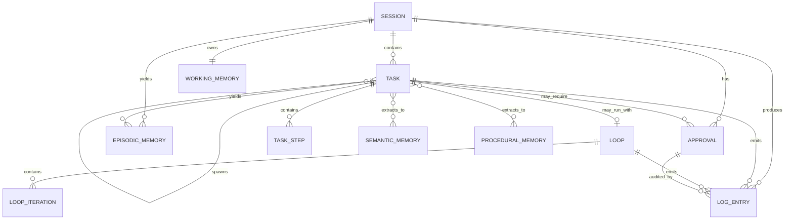

# 核心状态模型与状态机

> 本文档定义 CialloClaw 的正式状态模型。
>
> 目标：让系统的运行状态、业务状态、风险控制、记忆沉淀和审计追踪都有清晰边界。

---

## 1. 总体关系图



---

## 2. 状态建模原则

### 2.1 Session 是运行时根对象

Session 表示一次连续工作的上下文容器，所有短期运行状态都以它为根组织。

### 2.2 Task 是业务根对象

Task 是系统真正的业务工作单元，是用户能感知的“我现在在做哪件事”。

### 2.3 Loop 是控制器，不是业务目标

Loop 只负责驱动 Task 的多轮迭代，不应独立于 Task 存在。

### 2.4 Approval 必须实体化

确认流不能只做 UI 弹窗，必须是正式状态对象，支持超时、恢复、审计。

### 2.5 Log 与 Memory 必须分离

- Log：事实流水，不可变
- Memory：从事实中提炼出的可复用知识

---

## 3. Session 模型

### 3.1 作用

Session 用于表示一次连续工作会话，管理：

- 当前活跃任务
- 当前待确认操作
- 当前上下文快照
- 当前工作记忆
- 会话生命周期

### 3.2 建议结构

```go
type SessionStatus string

const (
    SessionActive  SessionStatus = "active"
    SessionPaused  SessionStatus = "paused"
    SessionClosing SessionStatus = "closing"
    SessionClosed  SessionStatus = "closed"
    SessionCrashed SessionStatus = "crashed"
)

type Session struct {
    ID                 string
    UserID             string
    DeviceID           string
    Status             SessionStatus

    StartedAt          time.Time
    LastActiveAt       time.Time
    EndedAt            *time.Time

    CurrentTaskID      *string
    ActiveTaskIDs      []string
    PendingApprovalIDs []string

    WorkingMemoryID    string
    ContextSnapshotID  *string

    TraceRootID        string
    Metadata           map[string]string
}
```

### 3.3 归属规则

- Session 持有引用，不直接塞入复杂业务细节
- 一个 Session 可以包含多个 Task
- 一个 Session 对应一个 WorkingMemory
- Session 结束时，可触发摘要与记忆沉淀

### 3.4 状态机

```text
active -> paused -> active
active -> closing -> closed
active -> crashed
paused -> closing -> closed
```

---

## 4. Task 模型

### 4.1 作用

Task 表示一个可追踪、可暂停、可恢复、可完成的业务工作单元。

示例：

- 回答一个问题
- 整理桌面文件
- 总结用户选中的文本
- 查询资料并产出结果
- 执行一个多步骤工作流

### 4.2 建议结构

```go
type TaskStatus string

const (
    TaskQueued    TaskStatus = "queued"
    TaskPlanned   TaskStatus = "planned"
    TaskRunning   TaskStatus = "running"
    TaskWaiting   TaskStatus = "waiting"
    TaskBlocked   TaskStatus = "blocked"
    TaskSucceeded TaskStatus = "succeeded"
    TaskFailed    TaskStatus = "failed"
    TaskCanceled  TaskStatus = "canceled"
)

type TaskKind string

const (
    TaskKindQuestionAnswer TaskKind = "question_answer"
    TaskKindResearch       TaskKind = "research"
    TaskKindFileOperation  TaskKind = "file_operation"
    TaskKindWriting        TaskKind = "writing"
    TaskKindCoding         TaskKind = "coding"
    TaskKindSystemAction   TaskKind = "system_action"
    TaskKindWorkflow       TaskKind = "workflow"
)

type Task struct {
    ID            string
    SessionID     string
    ParentTaskID  *string

    Kind          TaskKind
    Title         string
    Goal          string
    Status        TaskStatus
    Priority      int

    Planner       string
    AssigneeAgent *string

    Input         map[string]any
    Output        map[string]any
    Error         *string

    PlanID        *string
    LoopID        *string

    RetryCount    int
    MaxRetry      int

    CreatedAt     time.Time
    StartedAt     *time.Time
    UpdatedAt     time.Time
    CompletedAt   *time.Time

    TraceID       string
    Metadata      map[string]string
}
```

### 4.3 Task 归属规则

- Task 是大多数业务动作的归属对象
- 一个用户输入可能产生多个 Task
- 子任务必须通过 `ParentTaskID` 建立因果关系
- 除系统底层事件外，业务日志与审批都应尽量能关联到某个 Task

### 4.4 Task 状态机

```text
queued -> planned -> running
running -> waiting
running -> blocked
running -> succeeded
running -> failed
running -> canceled
waiting -> running
blocked -> running
failed -> queued   // retry
```

---

## 5. TaskStep 模型

### 5.1 为什么需要 TaskStep

如果 Task 是大工作单元，TaskStep 就是执行步骤。它用于：

- 展示进度
- 支持分步失败
- 支持审批挂起
- 支持精确日志与回放

### 5.2 建议结构

```go
type TaskStepStatus string

const (
    StepPending TaskStepStatus = "pending"
    StepRunning TaskStepStatus = "running"
    StepWaiting TaskStepStatus = "waiting"
    StepDone    TaskStepStatus = "done"
    StepFailed  TaskStepStatus = "failed"
    StepSkipped TaskStepStatus = "skipped"
)

type TaskStep struct {
    ID           string
    TaskID       string
    Index        int
    Name         string
    Description  string
    Status       TaskStepStatus

    AgentName    *string
    ToolName     *string

    Input        map[string]any
    Output       map[string]any
    Error        *string

    StartedAt    *time.Time
    EndedAt      *time.Time
}
```

### 5.3 归属规则

- Approval 优先绑定到 TaskStep
- Tool 调用结果优先回写到 Step，再汇总到 Task

---

## 6. Loop 模型

### 6.1 作用

Loop 用于描述某个 Task 的迭代执行状态。

典型场景：

- 搜索 → 判断不足 → 再搜索
- 写作 → 自检 → 重写
- 代码修改 → 测试 → 再修复
- 多 Agent 讨论若干轮后收敛

### 6.2 建议结构

```go
type LoopStatus string

const (
    LoopReady     LoopStatus = "ready"
    LoopRunning   LoopStatus = "running"
    LoopPaused    LoopStatus = "paused"
    LoopConverged LoopStatus = "converged"
    LoopStopped   LoopStatus = "stopped"
    LoopFailed    LoopStatus = "failed"
    LoopTimeout   LoopStatus = "timeout"
)

type Loop struct {
    ID               string
    SessionID        string
    TaskID           string

    Status           LoopStatus
    Strategy         string

    CurrentIteration int
    MaxIterations    int

    StopCondition    map[string]any
    ConvergenceState map[string]any
    BackoffState     map[string]any

    LastResultSummary *string
    LastScore         *float64

    CreatedAt        time.Time
    UpdatedAt        time.Time
    EndedAt          *time.Time

    Breakpoint       *string
    TraceID          string
}
```

### 6.3 LoopIteration 建议结构

```go
type LoopIteration struct {
    ID            string
    LoopID        string
    Index         int

    InputSummary  string
    ActionSummary string
    OutputSummary string

    Score         *float64
    Decision      string // continue / stop / fallback / ask_user

    StartedAt     time.Time
    EndedAt       *time.Time
}
```

### 6.4 Loop 状态机

```text
ready -> running
running -> paused
running -> converged
running -> stopped
running -> failed
running -> timeout
paused -> running
```

### 6.5 归属规则

- Loop 只能挂 Task，不能直接挂 Session
- 一个 Task 一般只有一个主 Loop
- 复杂场景下子 Task 可以拥有自己的 Loop

---

## 7. Approval 模型

### 7.1 作用

Approval 用于表示某个高风险操作在执行前等待用户确认的状态实体。

典型操作：

- 删除文件
- 移动大量文件
- 执行系统命令
- 打开外部网站
- 写入剪贴板
- 修改配置

### 7.2 建议结构

```go
type ApprovalStatus string

const (
    ApprovalPending  ApprovalStatus = "pending"
    ApprovalApproved ApprovalStatus = "approved"
    ApprovalRejected ApprovalStatus = "rejected"
    ApprovalExpired  ApprovalStatus = "expired"
    ApprovalCanceled ApprovalStatus = "canceled"
)

type ApprovalRisk string

const (
    RiskLow      ApprovalRisk = "low"
    RiskMedium   ApprovalRisk = "medium"
    RiskHigh     ApprovalRisk = "high"
    RiskCritical ApprovalRisk = "critical"
)

type Approval struct {
    ID             string
    SessionID      string
    TaskID         *string
    TaskStepID     *string
    LoopID         *string

    Status         ApprovalStatus
    Risk           ApprovalRisk

    ActionType     string
    ActionSummary  string
    ProposedArgs   map[string]any
    ResourceRefs   []string

    RequestedBy    string
    RequestedAt    time.Time
    DecidedBy      *string
    DecidedAt      *time.Time

    TimeoutAt      *time.Time
    Reason         *string

    ResumeToken    *string
    TraceID        string
}
```

### 7.3 状态机

```text
pending -> approved
pending -> rejected
pending -> expired
pending -> canceled
```

### 7.4 归属规则

- Approval 优先绑定到 TaskStep，其次绑定 Task
- Approval 自身不执行动作，只负责放行或拒绝
- 批准后由执行层恢复挂起流程

---

## 8. Memory 模型

---

### 8.1 WorkingMemory

WorkingMemory 表示当前会话中的临时上下文。

```go
type WorkingMemory struct {
    ID                 string
    SessionID          string

    CurrentIntent      *string
    CurrentFocus       *string
    SelectedContent    *string
    ActiveWindow       map[string]any

    RecentEventIDs     []string
    ActiveTaskIDs      []string
    PendingApprovalIDs []string

    TokenBudget        int
    ContextSummary     string

    UpdatedAt          time.Time
}
```

特点：

- 强绑定 Session
- 会话结束时可以丢弃或摘要化
- 面向认知层读取

---

### 8.2 EpisodicMemory

EpisodicMemory 表示历史经历的摘要化沉淀。

```go
type EpisodicMemory struct {
    ID            string
    SessionID     string
    TaskID        *string
    LoopID        *string

    Summary       string
    EventRefs     []string
    ArtifactRefs  []string

    Importance    float64
    Tags          []string
    CreatedAt     time.Time
}
```

来源：

- 已完成 Task
- 重要审批结果
- 关键循环过程
- 高价值用户交互

---

### 8.3 SemanticMemory

SemanticMemory 表示稳定事实知识。

```go
type SemanticMemory struct {
    ID              string
    Subject         string
    Predicate       string
    Object          string

    Confidence      float64
    SourceEpisodeIDs []string
    UpdatedAt       time.Time
}
```

例子：

- 用户偏好中文回复
- 用户主要在终端中工作
- 当前项目是本地桌面 Agent

---

### 8.4 ProceduralMemory

ProceduralMemory 表示成功做法、技能套路或可复用工作流。

```go
type ProceduralMemory struct {
    ID             string
    Name           string
    TriggerPattern string
    Steps          []map[string]any
    SuccessRate    float64
    SourceTaskIDs  []string
    UpdatedAt      time.Time
}
```

例子：

- “整理下载目录”的执行序列
- “代码解释 → 总结 → 输出 Markdown”的套路
- “搜索资料 → 去重 → 摘要”的流程模板

---

## 9. Log 模型

### 9.1 作用

LogEntry 用于记录不可变的事实流水，为调试、审计和回放服务。

### 9.2 建议结构

```go
type LogLevel string

const (
    LogDebug LogLevel = "debug"
    LogInfo  LogLevel = "info"
    LogWarn  LogLevel = "warn"
    LogError LogLevel = "error"
    LogAudit LogLevel = "audit"
)

type LogEntry struct {
    ID           string
    Timestamp    time.Time
    Level        LogLevel

    SessionID    *string
    TaskID       *string
    TaskStepID   *string
    LoopID       *string
    ApprovalID   *string

    EventID      *string
    TraceID      string
    SpanID       string
    ParentSpanID *string

    Category     string
    Message      string
    Payload      map[string]any
}
```

### 9.3 设计规则

- 只追加，不原地修改
- 所有重要状态变化都应留痕
- 记录“发生了什么”，而不是“当前结果是什么”
- Log 可作为 Memory 的来源，但不等同于 Memory

---

## 10. 统一关联键

建议所有核心对象都尽量带：

- `ID`
- `SessionID`
- `TaskID`（如适用）
- `LoopID`（如适用）
- `TraceID`
- `CreatedAt`
- `UpdatedAt`

此外建议在事件与日志中统一引入：

- `EventID`
- `SpanID`
- `ParentSpanID`

### 10.1 含义

- `EventID`：单个事件唯一 ID
- `TraceID`：一次完整工作链路共用的追踪 ID
- `SpanID`：链路中的局部步骤 ID
- `ParentSpanID`：用于表示因果关系

---

## 11. 核心归属规则

### 规则 1：Task 是业务归属对象

除底层系统事件外，几乎所有业务动作都应能挂靠到某个 Task。

### 规则 2：Loop 只能挂 Task

Loop 服务于完成 Task，不应独立于 Task 存在。

### 规则 3：Approval 优先挂 TaskStep

审批通常针对某一步具体动作，而不是整个任务。

### 规则 4：WorkingMemory 归属于 Session

长期记忆可以引用 Session，但不应“属于”某个 Session 根对象。

### 规则 5：Log 全局存在，但必须可反查

Log 不属于某个对象，但必须通过关联键反查到相关 Session/Task/Loop/Approval。

---

## 12. 最小可行状态模型（MVP）

如果需要先快速落地，建议第一版只实现：

1. Session
2. Task
3. Loop
4. Approval
5. LogEntry
6. WorkingMemory
7. EpisodicMemory

待系统稳定后，再补充：

- SemanticMemory
- ProceduralMemory
- TaskStep
- Artifact
- Snapshot / Checkpoint

---

## 13. 开发建议

### 第一优先级

- 先把对象正式建模，不要继续依赖零散 map 与临时变量
- 所有状态更新都通过 Repository / Store 接口统一管理
- 避免让 Event 本身承担“当前系统状态”职责

### 第二优先级

- 增加 TaskStep、TraceID、Approval 恢复能力
- 为 Session 和 Loop 增加快照/恢复能力

### 第三优先级

- 从完成任务中自动抽取 EpisodicMemory
- 再从 EpisodicMemory 提炼 Semantic / Procedural Memory
