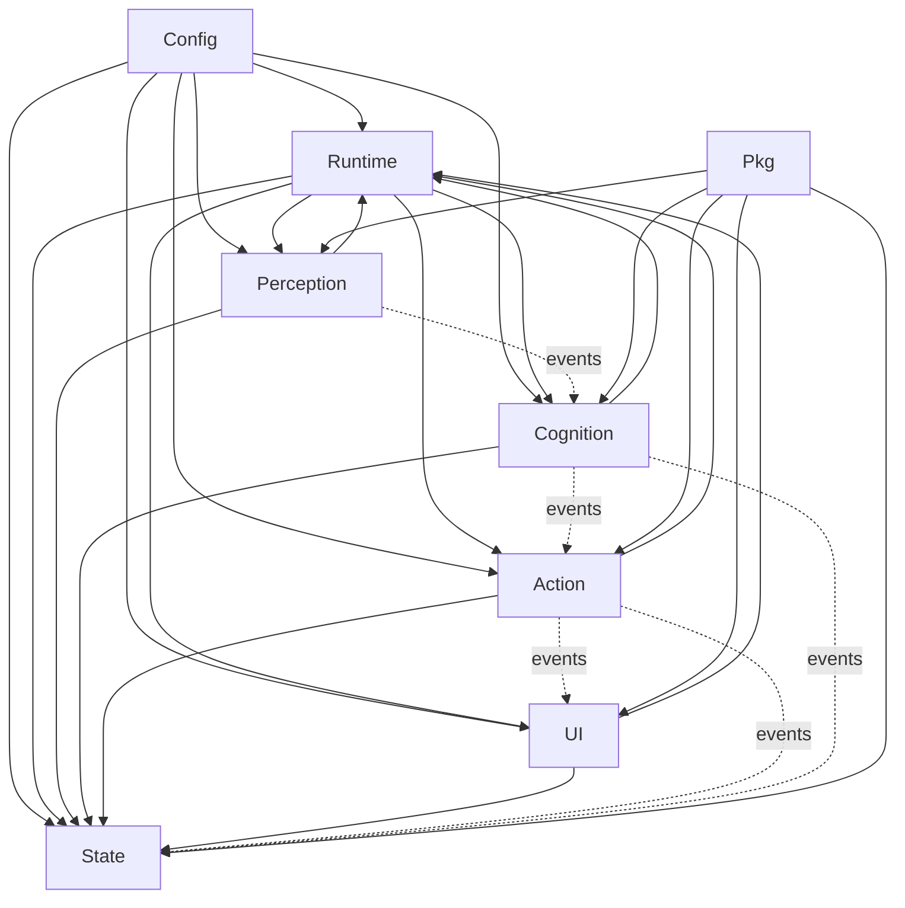

# 模块职责与依赖边界

> 目标：明确 CialloClaw 每个模块“负责什么、不负责什么、允许依赖什么、禁止依赖什么”。
>
> 这份文档不是目录说明，而是架构约束。它决定后续开发时新功能应该接到哪里，以及哪些写法属于违规。

---

## 1. 总原则

### 1.1 分层优先于目录

目录只是代码组织形式，真正重要的是职责边界。

### 1.2 事件驱动优先

默认原则：

- **跨层协作优先通过事件完成**
- 同层内部协作允许通过接口直接调用
- 低层不得反向依赖高层业务实现

### 1.3 状态对象集中管理

- Event 不是状态
- 状态必须落在 `state/*` 正式对象域中
- 不允许在任意订阅者里偷偷维护平行状态

### 1.4 扩展通过注册接入

新增能力优先通过以下方式接入：

- 新增 perception source
- 新增 subscriber
- 新增 middleware
- 新增 tool
- 新增 agent
- 新增 memory extractor
- 新增 UI 组件

禁止为了接一个新功能，直接改动多个无关模块的主链路。

---

## 2. 分层图



说明：

- 运行主干由 `runtime` 负责装配
- 业务层之间以事件为主，而不是直接持有彼此实现
- `pkg` 只提供通用能力，不承载业务状态

---

## 3. 模块边界总表

| 模块 | 负责 | 不负责 | 允许依赖 | 禁止依赖 |
|---|---|---|---|---|
| config | 配置加载、校验、热更新 | 业务决策 | pkg | 直接依赖业务层具体实现 |
| runtime | 生命周期、事件总线、worker、调度 | 业务语义、业务状态 | config、pkg | 写业务规则 |
| perception | 采集输入、生成原始事件 | 决策、执行 | runtime、state、pkg | 直接调 action/cognition 业务实现 |
| cognition | 上下文聚合、意图识别、规划、分派 | 直接做具体工具动作 | runtime、state、pkg | 直接操作 UI 或底层工具实现 |
| action | 审批、工具调用、执行编排 | 意图识别、长期记忆推理 | runtime、state、pkg | 越层改 cognition 内部状态 |
| state | 持久化与状态读写 | 触发业务决策 | pkg | 直接依赖 perception/cognition/action/ui |
| ui | 展示结果、收集交互 | 业务规划、工具执行 | runtime、state、pkg | 调 cognition/action 具体实现主逻辑 |
| pkg | 通用组件、公共抽象 | 业务流程、业务状态 | 无或标准库 | 反向依赖 internal 业务模块 |

---

## 4. Config 模块

路径建议：

```text
internal/config/
```

### 4.1 负责

- 配置结构定义
- 从文件/env/命令行加载配置
- 配置校验
- 配置热更新事件发布

### 4.2 不负责

- 根据配置执行具体业务
- 持有业务状态
- 调度模块行为

### 4.3 允许依赖

- `pkg/util`
- 标准库

### 4.4 输出接口

- `Load()`
- `Validate()`
- `Watch()`
- `Get()`

### 4.5 禁止事项

- 不要在 config 里初始化 tool、agent、ui
- 不要在 config 模块中写业务分支逻辑

---

## 5. Runtime 模块

路径建议：

```text
internal/runtime/
├── eventbus/
├── scheduler/
├── worker/
└── bootstrap/
```

### 5.1 负责

- 初始化系统运行主干
- 管理 EventBus、中间件链、订阅注册
- 管理 worker pool、调度器、生命周期
- 启动与停止顺序控制

### 5.2 不负责

- 不做意图识别
- 不做任务规划
- 不做工具业务语义
- 不保存业务状态真值

### 5.3 允许依赖

- `config`
- `pkg`
- 各模块暴露的接口，不依赖其内部实现

### 5.4 输出接口

- `Bootstrap()`
- `RegisterSubscriber()`
- `RegisterMiddleware()`
- `Start()`
- `Shutdown()`

### 5.5 禁止事项

- 不要把业务判断塞进 eventbus middleware
- 不要让 runtime 持有 task 业务逻辑

---

## 6. Perception 模块

路径建议：

```text
internal/perception/
├── user_input/
├── selection/
├── screen/
├── clipboard/
└── filewatch/
```

### 6.1 负责

- 监听用户输入和环境变化
- 将外部输入转成原始事件
- 做最小必要的预处理（去重、节流、基础类型识别）

### 6.2 不负责

- 不负责意图判断
- 不负责规划任务
- 不负责直接执行用户目标
- 不负责长期记忆解释

### 6.3 允许依赖

- `runtime/eventbus`
- `state` 中少量只读接口（如当前 session 上下文）
- `pkg`

### 6.4 典型输出

- `user.input.received`
- `selection.changed`
- `clipboard.changed`
- `screen.captured`
- `window.focus.changed`
- `file.changed`

### 6.5 禁止事项

- 不要在 perception 里直接调用 planner、director、tool executor
- 不要在 perception 里偷偷创建 Task

---

## 7. Cognition 模块

路径建议：

```text
internal/cognition/
├── context/
├── intent/
├── planner/
├── loop/
├── director/
└── agents/
```

### 7.1 负责

- 聚合上下文
- 识别意图
- 创建任务
- 生成计划
- 决定是否进入 loop
- 将任务分派给 agent / tool 执行路径

### 7.2 不负责

- 不直接操作终端、文件系统、浏览器
- 不负责用户确认 UI
- 不直接写日志实现细节

### 7.3 允许依赖

- `runtime/eventbus`
- `state` 仓储接口
- `pkg/llm`
- 工具和 agent 的抽象接口

### 7.4 典型输入

- `user.input.received`
- `selection.changed`
- `context.updated`
- `tool.call.completed`
- `approval.responded`

### 7.5 典型输出

- `intent.recognized`
- `task.created`
- `task.planned`
- `task.assigned`
- `loop.started`
- `loop.iterated`
- `loop.converged`

### 7.6 禁止事项

- 不要在 planner/director 中直接调用底层文件系统实现
- 不要让某个 agent 自己直接改 repository 真值而不经过状态服务
- 不要把审批逻辑塞到 cognition

---

## 8. Action 模块

路径建议：

```text
internal/action/
├── approval/
├── executor/
├── toolregistry/
└── tools/
```

### 8.1 负责

- 工具调用编排
- 高风险动作审批
- 执行动作并回写结果
- 处理重试、超时、取消

### 8.2 不负责

- 不做意图识别
- 不做高层任务目标规划
- 不负责 UI 展示策略

### 8.3 允许依赖

- `runtime/eventbus`
- `state` 仓储接口
- `toolregistry`
- `pkg`

### 8.4 典型输入

- `task.assigned`
- `loop.iterated`
- `approval.responded`

### 8.5 典型输出

- `task.execution.started`
- `tool.call.requested`
- `approval.requested`
- `tool.call.completed`
- `task.execution.completed`
- `task.execution.failed`

### 8.6 禁止事项

- 不要在 action 中重新解释用户意图
- 不要越权修改 cognition 的内部决策状态
- 不要绕过 approval policy 直接执行高风险操作

---

## 9. State 模块

路径建议：

```text
internal/state/
├── session/
├── task/
├── loop/
├── approval/
├── memory/
└── log/
```

### 9.1 负责

- Session / Task / Loop / Approval / Memory / Log 的正式存储与读取
- 状态迁移的持久化
- 快照、恢复、查询

### 9.2 不负责

- 不负责业务决策
- 不负责解释事件语义背后的意图
- 不负责 UI 行为

### 9.3 允许依赖

- `pkg`
- 存储实现
- 标准库

### 9.4 输出接口

- `SessionRepository`
- `TaskRepository`
- `LoopRepository`
- `ApprovalRepository`
- `MemoryRepository`
- `LogRepository`

### 9.5 禁止事项

- state 不得直接依赖 perception/cognition/action/ui 的具体实现
- repository 不得自己偷偷发布业务事件并改变流程含义，除非通过明确的状态服务层完成

---

## 10. UI 模块

路径建议：

```text
internal/ui/
├── tui/
├── notification/
└── interactive/
```

### 10.1 负责

- 展示消息、状态、任务进度、循环进度
- 收集用户确认、选择、文本输入
- 将交互结果发回系统

### 10.2 不负责

- 不做任务规划
- 不做工具调用
- 不决定业务状态真值

### 10.3 允许依赖

- `runtime/eventbus`
- `state` 查询接口
- `pkg`

### 10.4 典型输入

- `ui.message.display`
- `ui.notification.push`
- `ui.confirmation.requested`
- `task.created`
- `task.execution.completed`

### 10.5 典型输出

- `ui.confirmation.responded`
- `user.input.received`
- `ui.selection.made`

### 10.6 禁止事项

- 不要让 UI 直接调用 tool executor 执行操作
- 不要让 UI 成为业务状态的唯一来源

---

## 11. Pkg 模块

路径建议：

```text
pkg/
├── llm/
├── command/
└── util/
```

### 11.1 负责

- 提供跨模块可复用的通用抽象
- 提供与具体业务无关的工具能力

### 11.2 不负责

- 不负责业务流程
- 不负责状态存储真值
- 不持有 internal 业务依赖

### 11.3 禁止事项

- `pkg` 不得 import `internal/*`
- 不要把业务类型偷偷放进 `pkg`

---

## 12. 允许的直接调用边界

默认规则：

### 12.1 允许

- 同一子模块内部直接调用
- 同层模块之间通过接口调用
- `runtime/bootstrap` 在装配阶段直接调用各模块注册接口
- `action` 通过 `toolregistry` 调用工具实现
- `cognition` 通过 agent/tool 抽象接口做选择
- `ui` 通过 state 查询接口读取状态

### 12.2 不建议但可接受

- `perception` 为获取当前 session 读取 state 的只读接口
- `ui` 读取任务状态仓储用于展示

### 12.3 禁止

- `perception -> action/tools` 直接执行动作
- `ui -> action/tools` 直接执行动作
- `action -> cognition/planner` 直接改规划状态
- `state -> cognition/action/ui` 直接依赖具体实现
- 任意模块绕过 repository 直接改核心状态对象

---

## 13. 典型开发落点

### 13.1 新增一个感知源

应该落在：

- `internal/perception/<source>/`
- 通过 eventbus 发布新事件
- 可选注册去重/节流策略

不应该：

- 直接在感知模块里创建 task 并执行工具

### 13.2 新增一个工具

应该落在：

- `internal/action/tools/<tool_name>/`
- 实现统一 Tool 接口
- 在 `toolregistry` 注册
- 声明 schema、风险等级、是否需要审批

不应该：

- 在 cognition 里直接 import 某工具实现

### 13.3 新增一个 agent

应该落在：

- `internal/cognition/agents/<agent_name>.go`
- 实现 Agent 接口
- 在 registry 注册
- 通过 director/planner 分派给它

不应该：

- 让 agent 自己越过 director 擅自改主链路

### 13.4 新增一个记忆提炼器

应该落在：

- `internal/state/memory/` 或 `internal/cognition/memory_extractor/`
- 订阅 `task.execution.completed`、`loop.iterated` 等事件
- 将提炼结果写入 memory repository

不应该：

- 在任意工具执行后随意拼接字符串写入“记忆”文件

---

## 14. 违规信号清单

如果出现以下情况，说明边界开始腐化：

- 新功能要改 5 个以上无关模块才能接入
- 某个模块开始 import 大量其他层的具体实现
- UI 直接执行系统动作
- perception 直接写 task 状态
- action 自己做意图识别
- state 模块开始出现大量业务 if/else
- 事件只定义名字，没有生产者/消费者/载荷规范

---

## 15. 代码评审检查表

每次新增功能，评审时至少检查：

1. 它属于哪个层？
2. 是否放在正确目录？
3. 是否新增了明确事件？
4. 是否复用了已有状态模型？
5. 是否绕过了 approval policy？
6. 是否新增了跨层硬编码依赖？
7. 是否需要补到事件字典？
8. 是否需要补到状态模型或扩展文档？

如果第 5、6 条有任一项是“是”，应优先重构再合并。
