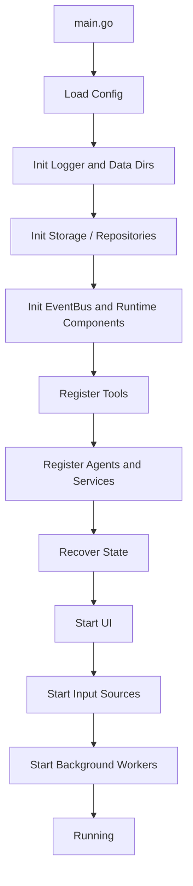

# 07-启动与运行时装配

> 目标：定义 CialloClaw 作为本地桌面 Agent 的启动顺序、依赖装配、运行时生命周期、关闭流程、恢复流程与扩展注册方式，避免后续开发中出现初始化顺序错乱、循环依赖、资源泄漏和恢复逻辑分散的问题。

---

## 1. 文档定位

本文件主要回答：

1. `main.go` 到底应该先初始化什么、后初始化什么。
2. 各层模块如何装配成可运行系统。
3. 感知源、Agent、Tool、Repository、UI 的注册顺序是什么。
4. 程序退出、崩溃恢复、后台任务、热重载该如何组织。
5. 新功能如何挂接到现有启动流程，而不破坏整体架构。

---

## 2. 总体启动原则

### 2.1 先基础设施，后业务组件，最后输入源

推荐启动顺序：

1. 配置
2. 日志
3. 存储 / repository
4. 事件总线
5. 运行时基础组件
6. 状态恢复
7. Tool 注册
8. Agent 注册
9. 认知与执行服务
10. UI
11. 感知输入源
12. 后台调度器

原因：

- 输入源一旦启动，事件就会流入系统
- 若 bus / repository / runtime / UI 尚未就绪，事件会丢失或进入不一致状态

### 2.2 启动顺序必须单向

不允许：

- perception 初始化时反过来创建 repository
- ui 初始化时去 new eventbus
- agent 在构造函数里直接 new toolregistry

所有核心依赖必须由 bootstrap 统一注入。

### 2.3 注册先于运行

所有以下对象都应先完成注册，再启动事件流：

- middlewares
- repositories
- tools
- agents
- subscribers
- ui handlers
- input watchers

---

## 3. 建议引入 Bootstrap 层

推荐新增目录：

```text
internal/bootstrap/
├── app.go
├── config.go
├── storage.go
├── bus.go
├── runtime.go
├── tools.go
├── agents.go
├── services.go
├── ui.go
├── perception.go
├── recovery.go
└── shutdown.go
```

### 3.1 Bootstrap 的职责

统一负责：

- 初始化顺序
- 依赖注入
- 组件注册
- 恢复流程
- 启停控制

### 3.2 Bootstrap 不负责

- 具体业务决策
- 事件处理逻辑
- task 规划
- tool 执行逻辑

---

## 4. 建议的 App 容器

建议引入顶层应用容器：

```go
package bootstrap

type App struct {
    Config        *config.Config
    Logger        Logger

    Bus           *eventbus.EventBus

    SessionRepo   session.Repository
    TaskRepo      task.Repository
    LoopRepo      loop.Repository
    ApprovalRepo  approval.Repository
    MemoryRepo    memory.Repository
    ProfileRepo   profile.Repository
    LogRepo       log.Repository
    BlobRepo      blob.Repository

    SessionMgr    *session.Manager
    WorkerPool    *worker.Pool
    Scheduler     *scheduler.Scheduler

    ToolRegistry  *toolregistry.Registry
    AgentRegistry *agents.Registry

    UI            UIComponent
    InputSources  []RuntimeComponent
    Services      []RuntimeComponent
    Recoverables  []Recoverable
    Closers       []io.Closer
}
```

这不是为了做“全局大对象”，而是为了把启动时的依赖图集中在一个位置。

---

## 5. main.go 建议职责

`cmd/desktop-assistant/main.go` 建议只做 4 件事：

1. 调用 bootstrap 创建应用
2. 调用 `app.Start(ctx)`
3. 等待系统信号 / UI 退出
4. 调用 `app.Shutdown(ctx)`

不要在 main.go 里直接写：

- 工具注册细节
- agent 构造细节
- perception watcher 细节
- sqlite 初始化细节

---

## 6. 启动阶段拆分

建议分成 8 个阶段。

---

### Phase 0：基础进程准备

职责：

- 建立根 context
- 捕获 panic
- 初始化退出信号
- 建立启动 trace

输出：

- `context.Context`
- 顶层 `cancel()`

---

### Phase 1：配置加载

加载来源建议：

1. 默认配置文件
2. 用户配置文件
3. 环境变量
4. 命令行参数

配置加载后立即做：

- 路径检查
- API Key 检查
- 权限检查
- 目录自动创建

此阶段失败应直接退出，不进入后续启动。

---

### Phase 2：日志与数据目录准备

职责：

- 初始化 logger
- 创建 `.data/` 目录
- 创建数据库文件目录
- 创建 blobs 目录
- 创建临时目录

推荐目录：

```text
.data/
├── app.db
├── logs/
├── blobs/
├── cache/
├── snapshots/
└── tmp/
```

---

### Phase 3：存储层初始化

职责：

- 打开 SQLite 连接
- 执行 migration
- 初始化 repository 实现
- 初始化 blob repository

输出：

- SessionRepository
- TaskRepository
- LoopRepository
- ApprovalRepository
- MemoryRepository
- ProfileRepository
- LogRepository
- BlobRepository

此阶段失败必须退出。

---

### Phase 4：事件总线与运行时基础组件初始化

职责：

- 创建 EventBus
- 注册全局 middleware
- 创建 session manager
- 创建 worker pool
- 创建 scheduler
- 创建基础 monitor / metrics

建议此阶段只初始化“壳”，暂不开始消费业务输入。

---

### Phase 5：功能注册

职责：

- 初始化 ToolRegistry
- 注册内置 tools
- 初始化 AgentRegistry
- 注册内置 agents
- 构造 planner / director / loop controller / approval service / memory manager 等服务
- 将相关 subscriber 注册到 eventbus

关键原则：

- **先注册，再运行**
- **禁止在 subscriber 启动后再补注册核心依赖**

---

### Phase 6：状态恢复

职责：

- 查询未结束 session
- 查询可恢复 task
- 查询 pending approval
- 查询 paused / running loop
- 加载最近 working memory snapshot
- 恢复 UI 所需摘要态

注意：

- 恢复时先更新状态，再决定是否重新发布恢复事件
- 不要在恢复阶段直接重跑所有 running task

推荐把恢复后的运行中对象先置为：

- session → `paused` 或 `recovering`
- task → `waiting` 或 `recovering`
- loop → `paused`

然后由明确的恢复策略决定是否继续。

---

### Phase 7：UI 启动

职责：

- 初始化 TUI
- 绑定 UI 到 bus
- 绑定 confirmation / selection handler
- 恢复必要视图状态

为什么 UI 在输入源之前启动：

- 用户输入、审批、通知都需要 UI 能立即接住

---

### Phase 8：输入源与后台组件启动

启动对象：

- user_input
- selection watcher
- clipboard watcher
- screen watcher（若启用）
- scheduler jobs
- cache cleanup
- approval timeout worker

这一步启动后，系统才算真正进入运行态。

---

## 7. 推荐启动顺序图



---

## 8. Runtime 组件分类

建议把可启动对象统一抽象成两类接口。

### 8.1 RuntimeComponent

```go
package bootstrap

type RuntimeComponent interface {
    Name() string
    Start(ctx context.Context) error
    Stop(ctx context.Context) error
}
```

适用于：

- UI
- user_input
- selection watcher
- clipboard watcher
- scheduler
- worker pool

### 8.2 Recoverable

```go
package bootstrap

type Recoverable interface {
    Name() string
    Recover(ctx context.Context) error
}
```

适用于：

- session manager
- task recovery service
- approval recovery service
- memory snapshot loader

这样做的好处是：

- 启动顺序清晰
- 新增组件容易挂接
- 关闭顺序可统一控制

---

## 9. Tool 注册策略

### 9.1 Tool 注册必须集中管理

推荐：

- `bootstrap/tools.go` 负责注册所有内置工具
- 插件工具走统一注册入口

不要在 Agent 构造函数里偷偷注册工具。

### 9.2 注册步骤

1. 创建 tool 实例
2. 校验 metadata / schema
3. 注册到 ToolRegistry
4. 写启动日志

### 9.3 建议分组注册

- browser tools
- terminal tools
- filesystem tools
- llm tools
- system tools
- clipboard tools
- windowmgr tools

---

## 10. Agent 注册策略

### 10.1 Agent 注册必须晚于 ToolRegistry

因为 agent 通常需要依赖：

- tool registry
- memory manager
- planner / director
- config

### 10.2 注册原则

- 基础 agent 先注册：assistant / researcher / writer / coder
- 特殊 agent 后注册：analyst / reviewer / organizer
- 插件 agent 最后注册

### 10.3 Agent 不应在构造时启动后台 goroutine

Agent 只注册能力，不主动跑循环。

---

## 11. Subscriber 注册策略

建议按层次注册：

### 11.1 先注册系统级 subscriber

- log / audit subscriber
- metrics subscriber
- trace subscriber
- error subscriber

### 11.2 再注册认知链路 subscriber

- context aggregator
- intent classifier
- planner
- director
- loop controller

### 11.3 再注册执行链路 subscriber

- approval flow
- tool executor
- result handler
- memory writer

### 11.4 最后注册 UI subscriber

- chat view updater
- notification handler
- confirmation handler

这样做的目的：

- 系统级观察能力先就位
- 业务链路再开始工作
- UI 最后接展示层

---

## 12. Middleware 注册顺序

中间件链顺序非常重要，建议按以下顺序：

1. trace / correlation middleware
2. validation middleware
3. dedup / idempotency middleware
4. rate limit middleware
5. audit middleware
6. logging middleware
7. dispatch middleware

原因：

- 先补 trace，便于后续记录
- 再校验，尽早拒绝非法事件
- 再去重，避免重复工作
- 再限流，保护系统
- 最后做日志与分发

---

## 13. 关闭顺序

关闭顺序必须与启动顺序相反。

推荐：

1. 停止新的输入源
2. 停止 scheduler 新任务投递
3. 通知 UI 进入 closing 状态
4. 等待 worker pool 完成或超时取消
5. 刷新内存快照
6. 关闭 repository / db / file handles
7. 关闭 logger

### 13.1 为什么先停输入源

避免系统在关闭过程中继续接收新事件，导致：

- 状态不一致
- 任务半提交
- approval 丢失

---

## 14. 崩溃恢复与启动恢复的关系

### 14.1 启动恢复不是“自动续跑”

恢复的目标是：

- 恢复状态可见性
- 恢复控制权
- 再决定是否继续执行

而不是盲目重跑。

### 14.2 建议恢复步骤

1. 加载恢复候选对象
2. 做状态降级
3. 写恢复日志
4. 发布恢复摘要到 UI
5. 等待用户确认或系统策略决定是否继续

---

## 15. 后台任务建议

后台任务建议统一交给 scheduler 或 worker pool，不要分散在各模块各自起 goroutine。

推荐后台任务：

- approval 超时扫描
- working memory 快照
- cache 清理
- blob 垃圾清理
- 日志轮转
- 向量索引重建

每个后台任务都应具备：

- name
- schedule
- timeout
- retry policy
- shutdown hook

---

## 16. 热重载建议

MVP 阶段不建议做“所有组件热重载”。

建议仅支持：

- 配置重载
- tool 开关重载
- 提示词配置重载
- 通知级别重载

不建议初期支持：

- repository 热切换
- eventbus 重建
- 核心组件热卸载

---

## 17. 扩展功能如何接入启动流程

新增一个功能时，应回答这几个问题：

1. 它是 RuntimeComponent、Recoverable，还是纯静态服务。
2. 它依赖哪些 repository / registry / bus。
3. 它在哪个 phase 注册。
4. 它启动时是否会产生事件。
5. 它关闭时是否需要 flush 或 snapshot。

### 17.1 新增 Tool

接入点：

- `bootstrap/tools.go`

### 17.2 新增 Agent

接入点：

- `bootstrap/agents.go`

### 17.3 新增感知输入源

接入点：

- `bootstrap/perception.go`

### 17.4 新增恢复逻辑

接入点：

- `bootstrap/recovery.go`

### 17.5 新增后台任务

接入点：

- `bootstrap/runtime.go` 或 `bootstrap/services.go`

---

## 18. 推荐的 Bootstrap 代码骨架

```go
func NewApp(ctx context.Context) (*App, error) {
    cfg, err := InitConfig(ctx)
    if err != nil {
        return nil, err
    }

    logger, err := InitLogger(cfg)
    if err != nil {
        return nil, err
    }

    repos, err := InitStorage(ctx, cfg, logger)
    if err != nil {
        return nil, err
    }

    bus := InitBus(logger)
    runtimeDeps := InitRuntime(cfg, logger, bus, repos)

    app := &App{
        Config:       cfg,
        Logger:       logger,
        Bus:          bus,
        SessionRepo:  repos.SessionRepo,
        TaskRepo:     repos.TaskRepo,
        LoopRepo:     repos.LoopRepo,
        ApprovalRepo: repos.ApprovalRepo,
        MemoryRepo:   repos.MemoryRepo,
        ProfileRepo:  repos.ProfileRepo,
        LogRepo:      repos.LogRepo,
        BlobRepo:     repos.BlobRepo,
        SessionMgr:   runtimeDeps.SessionMgr,
        WorkerPool:   runtimeDeps.WorkerPool,
        Scheduler:    runtimeDeps.Scheduler,
    }

    if err := RegisterTools(ctx, app); err != nil {
        return nil, err
    }
    if err := RegisterAgents(ctx, app); err != nil {
        return nil, err
    }
    if err := RegisterServices(ctx, app); err != nil {
        return nil, err
    }
    if err := RecoverState(ctx, app); err != nil {
        return nil, err
    }
    if err := InitUI(ctx, app); err != nil {
        return nil, err
    }
    if err := InitPerception(ctx, app); err != nil {
        return nil, err
    }

    return app, nil
}
```

---

## 19. 开发约束

1. 禁止在 main.go 中散落初始化代码。
2. 禁止跨模块偷偷 new 依赖。
3. 所有可启动组件都应接入统一生命周期管理。
4. 所有恢复逻辑都必须集中在 recovery phase。
5. 所有新增输入源必须在 UI 与 bus 就绪后再启动。
6. 所有新增后台任务必须支持 Stop(ctx)。
7. 启动失败必须快速失败，不允许半初始化运行。

---

## 20. 一句话总结

CialloClaw 的运行时装配应采用：

**Bootstrap 统一注入依赖，先初始化基础设施，再注册工具与 Agent，再恢复状态，最后启动 UI 和输入源；关闭顺序反向执行，恢复先收状态再决定是否续跑。**
