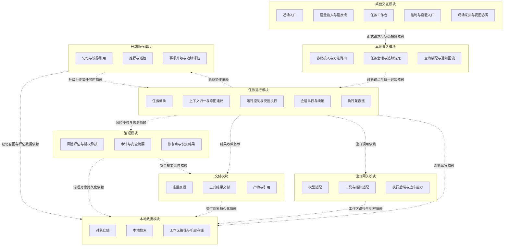
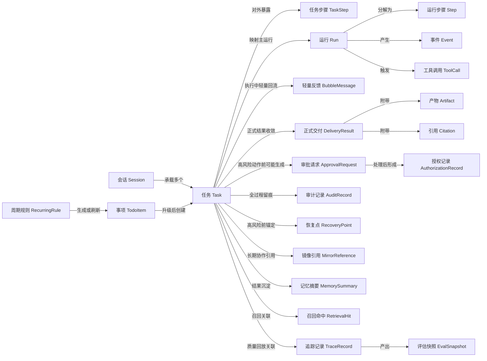
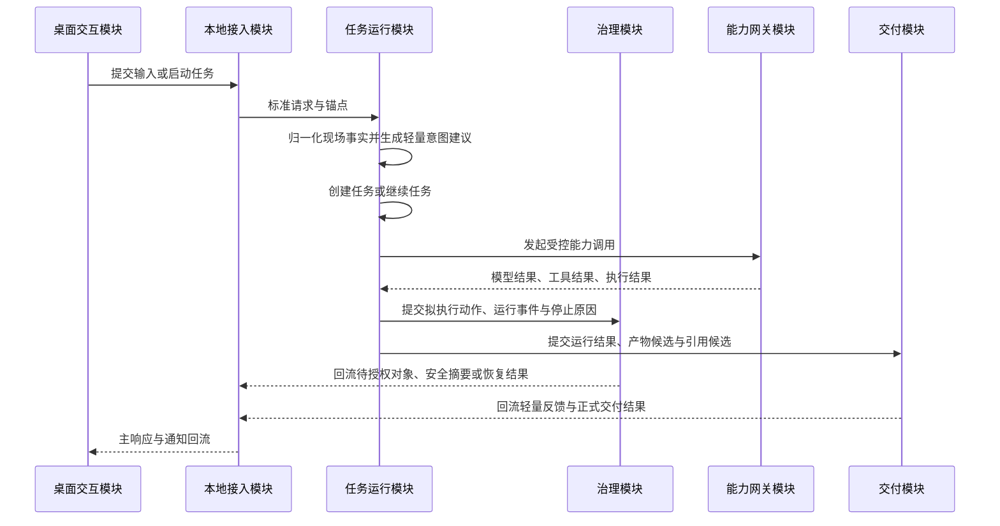
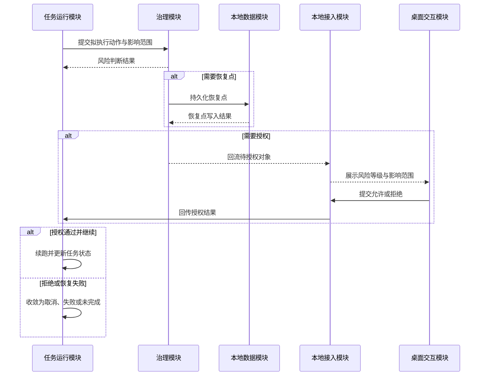
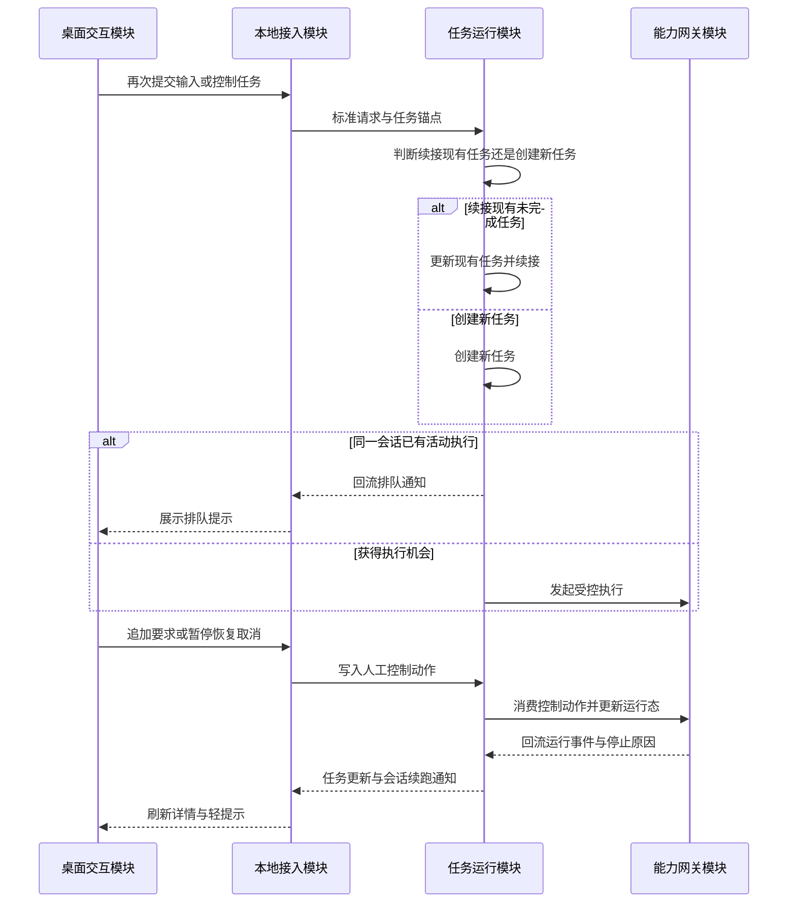
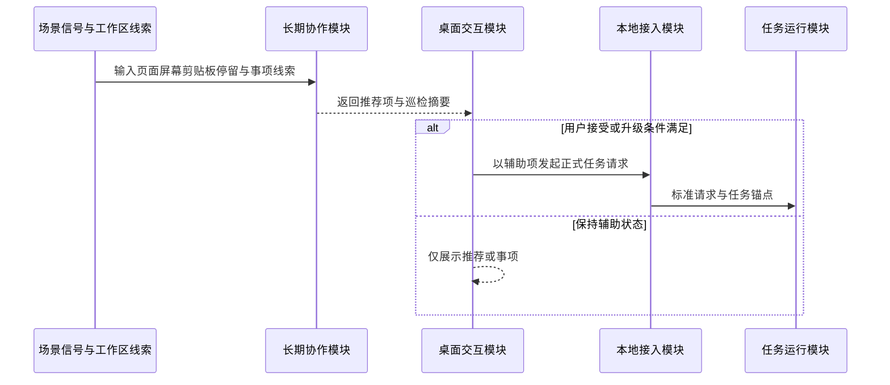
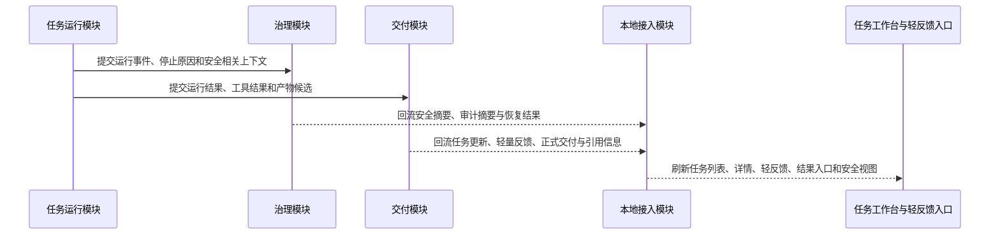

## 1. 文档目的与范围

### 1.1 文档目的

本文档定义 CialloClaw 当前阶段的系统架构基线，用于架构评审、研发对齐、模块详细设计拆分、协议与数据设计回写，以及后续实现验收。

本文档重点回答以下问题：

- 当前系统在产品形态、运行形态和工程形态上的正式边界是什么。
- 系统由哪些可独立演进的模块组成，各模块分别承担什么职责。
- 模块之间通过哪些正式对象、输入输出契约和依赖关系协作。
- `Task`、`Run`、`Step`、`Event`、`ToolCall` 以及治理、交付、记忆等对象分别处于什么边界。
- 典型用户故事如何由应用装配入口串联多个模块完成。
- 系统在性能、可靠性、安全治理、可观测性、可扩展性和可维护性方面采用什么架构策略。

本文档定位为“架构总览文档”。它回答系统级对象边界、模块边界、依赖关系和典型用户故事，不替代协议真源、数据真源、模块详细设计和工程实现细节。

### 1.2 文档覆盖范围

本文档覆盖当前正式主链涉及的系统子域和职责边界，重点包括：

- **桌面交互模块**：负责近场触发、轻量承接、任务工作台、控制入口、现场采集和状态投影等桌面侧职责。
- **本地接入模块**：负责 JSON-RPC 接入、Windows Named Pipe 正式链路、调试态 HTTP / SSE 兼容链路、对象锚定、查询装配和通知回流。
- **任务运行模块**：负责 `Task` 生命周期、上下文归一、意图建议、任务创建与续接、会话串行、人工控制、`Run / Step / Event / ToolCall` 执行兼容链以及受控执行循环。
- **治理模块**：负责风险评估、审批承接、授权记录、审计、安全摘要、恢复点和恢复结果回流。
- **交付模块**：负责轻量反馈、正式结果交付、Artifact、Citation、DeliveryResult 与结果收敛。
- **能力网关模块**：负责模型适配、工具路由、插件能力、执行后端和 sidecar worker 的统一接入。
- **本地数据模块**：负责对象仓储、本地检索、Workspace、Artifact 目录、路径策略和机密存储。
- **长期协作模块**：负责记忆、镜像引用、推荐、巡检、事项升级、Trace / Eval 以及长期协作能力与正式任务链之间的关系。

本文档按这些模块说明“讨论哪些部分、讨论到什么边界、职责如何通过对象和契约协作”，而不把仓库目录和内部包结构当作主叙事对象。

### 1.3 非目标

本文档不展开以下内容：

- 页面级交互细节、动效、按钮行为、视觉样式和产品文案。
- JSON-RPC 方法级字段定义、错误码枚举、通知字段约定和 schema 细节。
- 表结构、索引、DDL、迁移脚本、序列化格式和文件落盘细节。
- 模块内部类图、函数签名、Prompt 细节、工具参数模板与代码级实现。
- CI、Linter、测试策略、提交规范、技能资产管理和排期执行细节。

上述内容分别以下游文档为准：协议设计文档、数据设计文档、模块详细设计文档和工程规范文档。

## 2. 系统定位、问题空间与设计目标

### 2.1 系统定位

CialloClaw 当前是一个 **Windows 优先落地、以本地 Harness 为中枢、以 `Task` 为对外主对象组织系统** 的桌面协作 Agent 工程。

从当前仓库和文档基线看，它不是以聊天窗口为中心的通用 AI 客户端，而是由桌面交互、本地接入、任务运行、治理交付、能力网关、本地数据和长期协作能力共同构成的本地协作系统。

系统定位可以归纳为三点：

- **产品上**，它围绕桌面现场和持续任务工作，而不是围绕单一聊天窗口。
- **运行上**，它以 `Task` 为对外主对象，以 `Run / Step / Event / ToolCall` 作为后端执行兼容链。
- **工程上**，它通过本地 Harness 组织桌面入口、任务运行、治理闭环、交付收敛、能力适配、本地存储和长期协作能力，而不是单体聊天应用。

补充约束：屏幕分析、错误承接、选区承接、文件拖拽承接等现场型入口，仍然沿同一条 `task-centric` 主链路进入系统，不另立平行架构。

### 2.2 问题空间

CialloClaw 需要解决的不是“用户如何和模型多聊几轮”，而是“用户如何在当前桌面现场直接发起协作，并让系统以可控、可追踪、可恢复的方式完成任务”。

这要求架构同时处理以下问题：

1. **现场承接问题**：输入可能来自选区、页面、报错、拖拽文件、便签事项、历史任务、推荐提示和仪表盘动作，系统必须直接接住这些现场，而不是要求用户先切到聊天页重新组织上下文。
2. **任务持续推进问题**：系统必须围绕 `Task` 组织状态、授权、交付和详情视图，而不是围绕一轮轮聊天消息组织状态。
3. **执行安全问题**：文件写入、网页交互、命令执行、依赖安装和工作区外访问等副作用动作必须被风险评估、授权、审计和恢复点机制约束。
4. **结果交付问题**：系统必须支持轻量反馈与正式交付分离，而不是把所有结果都压缩成同一种输出形式。
5. **长期协作问题**：系统需要记忆、推荐、巡检、待办升级和 Trace / Eval 能力，但这些能力不能污染任务主状态机和正式业务真源。
6. **会话连续性问题**：用户在同一桌面现场中的后续补充，有时应续接现有未完成任务，有时应开启新任务；架构必须提供稳定的续接与串行边界，而不是让多个入口无序推进。

### 2.3 架构设计目标

当前架构以以下目标为准：

- 建立以 `Task` 为核心对象的统一主链路。
- 保持 `task-centric` 对外语义与 `run-centric` 执行兼容链的稳定映射。
- 让本地 Harness 掌握任务生命周期，把模型、工具、worker 和插件限制在受控能力边界中使用。
- 让风险、授权、交付、审计、恢复、记忆和预算治理成为主链的一部分，而不是外围附属。
- 让桌面交互、本地接入、任务运行、治理、交付、能力网关、本地数据和长期协作边界清晰可演进。
- 让运行时事件、结果回流、任务详情和安全摘要围绕同一组正式对象展开。

## 3. 系统边界与设计原则

### 3.1 系统边界

CialloClaw 当前负责以下内容：

- 桌面交互模块的任务触发、现场采集、轻量承接、任务工作台、控制入口与状态投影。
- 本地接入模块的 JSON-RPC 接入、Windows Named Pipe 正式链路、调试态 HTTP / SSE 兼容链路、对象锚定、查询装配与通知回流。
- 任务运行模块的任务编排、上下文归一化、意图建议、运行控制、Agent Loop、会话串行、会话续接、人工 steer / pause / resume / cancel，以及推荐和巡检升级后的正式任务承接。
- 治理与交付相关能力，包括风险判断、审批承接、授权记录、正式交付、记忆写入、镜像引用、审计留痕、恢复点创建、恢复回流、Trace / Eval 与预算治理。
- 能力网关与本地数据相关能力，包括结构化存储、索引召回、Workspace、Artifact、机密存储、工具路由、执行后端与 sidecar worker 协作。

当前不负责以下内容：

- 多用户协作与跨设备一致性。
- 云端中心化调度与分布式执行编排。
- 面向第三方开放的平台级插件生态承诺。
- 页面交互动效、视觉规范和组件级状态机设计。
- 以工程治理为中心的流程说明和排期文档替代。

### 3.2 设计原则

架构遵循以下原则：

- **任务中心**：以 `Task` 作为正式主对象，而不是聊天轮次或临时会话消息。
- **运行兼容**：对外围绕 `Task` 组织，对内保留 `Run / Step / Event / ToolCall` 以支撑执行、排障和回放。
- **本地优先**：优先在本地完成编排、治理、持久化、索引和恢复。
- **模块边界清晰**：桌面交互模块不做主状态机推进，本地接入模块不做业务决策，能力网关模块不承载产品语义，本地数据模块不直接形成产品语义。
- **模块不是包**：模块应具有清晰输入输出约束，并具备独立迭代或独立版本管理能力；包只是代码物理组织单元，不能因为一个包存在就把它提升为架构模块。
- **用户故事不是模块**：用户故事是一系列业务操作的时序集合，可以由应用装配入口串联多个模块完成，但不作为模块拆分依据。
- **模块关系表达依赖**：总体架构图只表达模块依赖关系，不表达调用链路；业务操作顺序只在核心链路设计中说明。
- **治理内建**：风险、授权、审计、恢复、Trace / Eval 和预算治理必须能影响主链路，而不只是补日志。
- **正式出口统一**：正式结果必须通过 `BubbleMessage / DeliveryResult / Artifact / Citation` 等正式对象回流，而不是由工具或 worker 直接冒充最终结果。
- **辅助链路受控接入**：感知、推荐、巡检、记忆和镜像引用服务长期协作，但不能直接改写任务主状态机。
- **不发明未冻结真源**：解释架构时可以使用说明性称谓，但不能把未在当前代码、协议或数据真源中冻结的临时概念写成正式对象。

## 4. 总体架构

本章说明系统由哪些模块组成，以及这些模块通过哪些正式对象和契约形成依赖关系。这里的“依赖”指模块完成自身职责时需要消费另一个模块提供的稳定能力或对象，不表示运行时调用顺序，也不表示层级结构。

模块划分按照以下标准判断：是否拥有清晰输入输出、是否能被独立讨论和验收、是否承担稳定业务语义、是否需要独立演进或版本管理，以及模块名是否准确反映业务功能。因此，`taskcontext`、`intent`、`risk`、`delivery`、`checkpoint`、`recommendation`、`perception` 等实现包不自动等同于架构模块；它们可以作为模块内部的包、子能力或实现线索出现。

### 4.1 总体架构图

下图只表达模块依赖关系，不表达模块调用链路、启动顺序或层级结构。

阅读约束：

- 该图不是请求调用链。
- 该图不表达启动顺序、执行顺序或返回顺序。
- 该图不使用层级编号，不把模块放入上下层关系中解释。
- 箭头只表示某个模块完成自身职责时依赖另一个模块提供的正式契约。
- 业务操作的时序关系放在“核心链路设计”章节，不作为模块关系定义依据。

### 4.2 主链与反馈链的阅读方式

从业务运行角度看，系统仍然存在主任务链和正式反馈链；但它们用于解释典型用户故事中的业务操作顺序，不用于定义模块依赖关系。

- **主任务链**：请求从桌面现场进入本地接入边界，由任务运行模块围绕 `Task` 组织创建、续接、运行控制和执行兼容链，并在需要时依赖治理、交付、能力网关和本地数据模块完成后续处理。
- **正式反馈链**：授权请求、运行事件、正式结果、恢复结果、安全摘要和状态投影统一回到本地接入边界，再投影给桌面交互模块。

当前系统中的正式反馈至少包括以下类型：

- 审批回流：待授权对象、授权结果、恢复前确认。
- 结果回流：轻量反馈、正式交付、产物入口、引用信息。
- 状态回流：任务更新、运行事件、工具调用完成、会话排队与续跑。
- 安全回流：安全摘要、审计结果、恢复结果、恢复后状态收敛。

反馈链的存在是为了让系统具备“执行中可见、治理中可见、恢复时可见”的能力，但任何反馈都不能绕过 `Task` 主对象和正式协议边界，直接形成新的业务状态。

### 4.3 模块职责总览

| 模块 | 负责内容 | 主要输出 | 不负责事项 |
| --- | --- | --- | --- |
| 桌面交互模块 | 现场承接、轻量输入、轻反馈、任务工作台、控制入口、状态投影 | 标准任务请求、人工控制动作、展示请求 | 不判断是否新任务，不推进任务状态，不直连模型或数据库 |
| 本地接入模块 | JSON-RPC、Named Pipe、HTTP / SSE 调试兼容、对象锚定、查询装配、通知回流 | 标准化请求、对象锚点、统一通知、聚合查询结果 | 不做任务规划，不做风险判断，不透传内部原始结果 |
| 任务运行模块 | `Task` 生命周期、创建与续接、上下文归一、意图建议、会话串行、人工控制、`Run / Step / Event / ToolCall` 执行兼容链、受控执行循环 | 任务快照、运行事件、停止原因、治理请求、能力调用请求、交付候选 | 不直接绕过治理执行高风险动作，不直接把 worker 原始结果作为正式交付 |
| 治理模块 | 风险判断、审批承接、授权记录、审计、安全摘要、恢复点和恢复结果 | `ApprovalRequest`、`AuthorizationRecord`、`AuditRecord`、`RecoveryPoint`、安全摘要 | 不替代任务状态机，不作为完整回滚编排器 |
| 交付模块 | 轻量反馈、正式结果、产物、引用和交付收敛 | `BubbleMessage`、`DeliveryResult`、`Artifact`、`Citation` | 不执行模型或工具，不把原始日志直接作为正式结果 |
| 能力网关模块 | 模型、工具、插件、执行后端、sidecar worker 的统一适配 | 标准化模型结果、工具结果、执行结果、worker 结果 | 不拥有产品语义，不直接面向前端 |
| 本地数据模块 | 对象仓储、本地检索、Workspace、Artifact 目录、路径策略、机密存储 | 持久化对象、索引命中、工作区路径、机密读取结果 | 不决定任务业务状态，不绕过模块提供产品语义 |
| 长期协作模块 | 记忆、镜像引用、推荐、巡检、事项升级、Trace / Eval | 记忆摘要、推荐项、巡检摘要、事项候选、追踪记录、评估快照 | 不直接改写任务主状态机 |

### 4.4 模块间正式交接件

| 依赖发起模块 | 被依赖模块 | 正式交接件 | 说明 |
| --- | --- | --- | --- |
| 桌面交互模块 | 本地接入模块 | JSON-RPC 请求载荷、人工动作、视图请求 | 桌面交互模块只传递事实和动作，不附带执行决策 |
| 本地接入模块 | 任务运行模块 | 标准化请求参数、`session_id`、`task_id`、`trace_id` 锚点 | 本地接入模块负责收口和关联，不改写业务判断 |
| 任务运行模块 | 治理模块 | 拟执行动作、影响范围、运行事件、停止原因 | 治理模块围绕任务执行过程构造审批、审计和恢复对象 |
| 任务运行模块 | 交付模块 | 运行结果、工具结果、产物候选、引用候选、停止原因 | 交付模块负责轻反馈和正式结果收敛 |
| 任务运行模块 | 能力网关模块 | 标准化模型 / 工具 / 执行请求 | 任务运行模块只通过适配器消费底层能力 |
| 任务运行模块 | 本地数据模块 | 任务对象读写、查询请求、运行事件写入计划 | 数据模块提供真源读写，不决定产品语义 |
| 治理模块 | 本地数据模块 | 审批对象、授权记录、审计记录、恢复点写入计划 | 治理对象必须对象化持久化 |
| 交付模块 | 本地数据模块 | 交付对象、artifact 持久化计划、引用写入计划 | 正式结果必须落到对象链 |
| 长期协作模块 | 任务运行模块 | 推荐升级、巡检升级、事项升级请求 | 升级时必须重新进入正式任务入口 |
| 治理模块 / 交付模块 / 任务运行模块 | 本地接入模块 | `ApprovalRequest`、`DeliveryResult`、`Artifact`、`Citation`、安全摘要、恢复结果、任务更新 | 所有回流对象统一经过本地接入模块再投影到桌面交互模块 |

### 4.5 跨模块约束

- 桌面交互模块只处理现场与展示，不理解 `Run / Step / Event / ToolCall` 的内部兼容结构。
- 本地接入模块可以做方法校验、对象锚定、通知封装和查询装配，但不能承担任务规划、风险判断或执行状态推进职责。
- 任务运行模块是唯一正式任务中枢；worker、plugin、sidecar 和前端入口都不能自行持有 `Task / Run` 状态机。
- 治理模块必须能真正改变主链，而不是在执行完成后单独补日志。
- 交付模块是正式结果出口；工具原始输出、模型原始回复和 worker 原始日志都不能跳过交付模块直接显示为正式结果。
- 能力网关模块只能提供受控能力，不直接形成产品语义，也不直接把底层结果越界推送给前端。
- 本地数据模块提供真源读写、索引和路径边界，不直接决定任务业务状态。
- 任何运行结果、工具结果、恢复结果和推荐升级结果，都必须回到正式对象链后才能决定是否展示、持久化或继续执行。

## 5. 关键架构对象与边界

### 5.1 对外正式对象、执行兼容对象与协调结构

当前架构中的对象按以下边界理解：

| 类型 | 代表对象 | 架构作用 |
| --- | --- | --- |
| 对外正式对象 | `Task`、`TaskStep`、`BubbleMessage`、`DeliveryResult`、`Artifact`、`Citation`、`ApprovalRequest`、`AuthorizationRecord`、`AuditRecord`、`RecoveryPoint`、`TodoItem`、`RecurringRule`、`MirrorReference` | 面向前端、协议和工作台的正式对象 |
| 后端执行兼容对象 | `Run`、`Step`、`Event`、`ToolCall` | 用于执行、排障、回放和运行时事件表达 |
| 治理与长期协作对象 | `MemorySummary`、`MemoryCandidate`、`RetrievalHit`、`TraceRecord`、`EvalSnapshot` | 服务记忆召回、镜像引用、质量评估与回放 |
| 运行时协调结构 | 任务上下文快照、轻量意图建议、任务-运行桥接记录、持久化写入计划、恢复候选 | 仅用于当前实现中的编排、状态推进和持久化协同，不构成新增协议真源 |

除上表中的正式对象外，本文档中出现的“请求载荷”“执行上下文”“能力结果”等词仅用于解释模块输入输出，不构成新的正式协议对象或数据真源。

补充边界：

- `Task` 是对外主对象，前端、任务工作台、安全摘要、正式交付和恢复入口统一围绕 `task_id` 组织。
- `Run` 是执行兼容对象，服务于运行时控制、事件回放、排障观察和执行内核，不替代 `Task` 成为对外主对象。
- `Task` 与其主 `Run` 及派生的 `Step / Event / ToolCall` 必须保持稳定映射，任务详情依赖这组对象的投影，而不是越界暴露内部结构。

### 5.2 核心对象关系图

下图只表达对象之间的稳定关联，不表达模块调用关系。

该图表达的是一条从“会话承接—任务执行—治理交付—长期协作”的完整对象关系：

- `Task` 是对外主对象。前端工作台、任务详情、正式交付、安全摘要和恢复入口都围绕它组织。
- `Run / Step / Event / ToolCall` 是执行兼容链。它们为运行控制、排障、事件回放和工具调用观察服务，不直接替代 `Task` 成为前端主对象。
- `BubbleMessage` 与 `DeliveryResult` 分工存在：前者解决执行中的轻量反馈，后者负责正式交付收敛，并进一步关联 `Artifact` 与 `Citation`。
- `ApprovalRequest / AuthorizationRecord / AuditRecord / RecoveryPoint` 组成治理闭环，确保高风险动作不会绕开审批、审计与恢复约束。
- `MirrorReference / MemorySummary / RetrievalHit / TraceRecord / EvalSnapshot` 组成长期协作与质量回放链，它们与任务主链稳定关联，但不改写任务主状态机。
- `RecurringRule / TodoItem` 属于事项侧对象。事项升级为任务时，会进入新的正式任务链，而不是把事项状态直接混入运行态。

### 5.3 状态边界与辅助链路边界

从架构视角看，当前任务状态可分为四组：

- **输入承接态**：围绕输入是否充分、意图是否确认收敛。
- **执行推进态**：围绕正式执行、等待授权、人工暂停、阻塞排队等运行控制阶段收敛。
- **结果收敛态**：围绕完成、失败、取消、未完成收尾等终态收敛。
- **治理投影态**：围绕安全摘要、恢复结果、恢复后状态、审计状态等治理视图收敛。

补充边界：

- `current_step` 和 `current_step_status` 用于表达任务详情中的当前阶段投影，但不替代正式主状态。
- `session_queue`、`human_in_loop`、`waiting_authorization`、`risk_blocked` 等运行控制阶段属于任务详情投影与运行控制语义，不应被提升为新的产品主对象。
- 推荐、巡检、事项和镜像引用默认都不是任务主状态；只有在用户接受或升级条件满足时，才重新进入正式任务入口。
- 同一隐藏会话内，未完成任务可以吸收后续补充输入；但这种“续接”必须由任务运行模块判断并收口，而不是由前端或 worker 直接决定。

## 6. 逻辑模块与协作边界

### 6.1 桌面交互模块

#### 职责定位

桌面交互模块负责把用户当前桌面现场转换成统一的任务请求，并把后端回流的状态、结果和授权信息投影回桌面界面。

它承担四类职责：

- 承接近场触发，例如悬浮球点击、选区触发、拖拽文件、错误信息承接、剪贴板承接和快捷入口唤起。
- 组织轻量输入，例如一句话补充说明、简短确认、继续执行、暂停、恢复、取消和授权确认。
- 承载正式查看入口，例如任务列表、任务详情、历史结果、安全摘要、恢复入口和事项入口。
- 维持统一视图投影，把同一条任务在悬浮气泡、工作台和控制入口中的状态表现保持一致。

这一模块可以理解当前窗口、选区、拖拽文件、剪贴板和页面停留等“桌面事实”，但不能自行决定任务如何编排、是否续接旧任务、是否需要授权，也不能直接解释 `Run / Event / ToolCall` 级别的内部运行细节。

#### 关键边界

- 悬浮球、气泡和工作台都不能各自维护一套独立任务状态；展示状态必须以本地接入模块回流的正式对象投影为准。
- 现场采集只能提供事实，不得把“这一定是新任务”或“这一定是旧任务续接”写死在前端。
- 页面停留、截图、选区、拖拽文件和报错承接都必须先经过统一请求收口，不能从前端直接旁路调用模型、worker 或执行后端。
- 交互级去抖、节流、局部 loading 和临时面板状态不能覆盖正式业务状态。

### 6.2 本地接入模块

#### 职责定位

本地接入模块是桌面端与本地 Harness 服务之间唯一稳定的正式边界，负责三件具体事情：收口协议、锚定对象、回流结果。

它承担以下职责：

- 对所有前端调用统一提供 JSON-RPC 方法入口，并在连接维度维持请求响应和异步通知的一致性。
- 把输入绑定到明确的 `task_id`、`session_id`、`trace_id` 等锚点，避免不同入口对同一任务产生不同引用方式。
- 把后端产生的任务更新、待授权对象、交付结果、安全摘要和恢复结果重新装配成前端可直接消费的查询结果和通知。
- 保持 Windows Named Pipe 正式链路与调试态 HTTP / SSE 兼容链路在对象语义和通知语义上的一致性。

它不是业务编排模块，也不是查询真源模块。它的核心价值在于“统一收口”和“统一回流”。

#### 关键边界

- 本地接入模块不能根据页面来源、入口来源或按钮来源自行改写业务含义，例如把“补充输入”直接变成“创建新任务”。
- 本地接入模块不能把执行运行中的内部缓存、worker 原始输出或模型 provider 响应直接透传给前端长期消费。
- 所有通知必须从统一回流口发出，不能让治理、交付、任务运行、能力网关等模块各自推送前端。
- HTTP / SSE 只用于调试和联调，不改变正式对象语义和通知语义。

### 6.3 任务运行模块

#### 职责定位

任务运行模块是系统的主控制模块，负责把“一个入口动作”变成“一条受控任务链”。它合并承担原先“任务核心”和“执行运行时”的职责，统一管理 `Task` 生命周期与 `Run / Step / Event / ToolCall` 执行兼容链。

它承担以下职责：

- 判断当前输入应该创建新任务、续接旧任务、进入会话排队，还是进入恢复流程。
- 把文本、文件、截图、页面和错误信息归一成可执行的上下文快照。
- 在真正执行前给出轻量意图建议，但保留任务运行模块对主流程的控制权。
- 推进正式任务状态，把运行细节收敛到 `Task` 主对象及其执行兼容链的投影上。
- 协调会话串行、人工控制、暂停、恢复、取消和执行续跑。
- 管理 `Run / Step / Event / ToolCall`，用于执行、排障、事件回放和工具调用观察。
- 将推荐、巡检和场景感知等辅助链路接入正式任务入口，但不让它们直接劫持主状态机。

#### 关键边界

- 上下文归一只负责“把事实收集全”，意图建议只负责“给出建议”，两者都不能直接改写 `Task` 状态。
- 任务运行模块是唯一正式任务状态推进点；即便执行发生在 Agent Loop、工具路由或 worker 中，任务状态也必须回到任务运行模块收敛。
- 会话续接必须以“该任务是否仍可吸收后续输入”为前提；等待授权、人工暂停、恢复处理中或已完成任务不能被隐式续接覆盖。
- 屏幕分析、页面承接、文件拖拽、错误承接和推荐升级都必须进入同一任务运行模块，不允许按入口类型分裂成多套任务状态机。
- 推荐和巡检只负责发现机会或生成候选，不得绕过用户接受和任务运行模块决策直接落成正式任务。
- 工具原始输出、模型原始回复和 worker 原始日志都不能跳过治理与交付边界直接显示为正式结果。

### 6.4 治理模块

#### 职责定位

治理模块负责把高风险动作、授权、审计、安全摘要和恢复点组织成可追踪、可确认、可恢复的正式治理闭环。

它处理四类关键决策：

- 这一步动作能不能执行，是否需要授权，是否应该先建立恢复点。
- 高风险动作的影响范围如何表达，用户如何理解授权后果。
- 这条任务要不要写入审计、Trace / Eval 或安全摘要。
- 当高风险动作失败或用户请求恢复时，如何把恢复结果重新并入任务主链。

#### 关键边界

- 风险评估发生在高风险动作之前，不能等命令执行或文件落盘之后再补审批。
- 风险判断只负责给出稳定、可测试的判断结果，不直接改任务状态；真正进入等待授权、继续执行或终止收敛，必须由任务运行模块接管。
- 恢复点能力只解决“如何建立恢复锚点”和“如何回流恢复结果”，不应被写成完整的回滚编排器或数据回滚真源。
- 审批、授权、审计、恢复点和安全摘要必须对象化，不能散落在日志中。
- 治理模块不新建业务任务，不取代任务运行模块。

### 6.5 交付模块

#### 职责定位

交付模块负责把运行结果收敛为用户可理解、可打开、可引用、可追踪的正式输出。

它承担以下职责：

- 将执行中的简短进展、提醒和阶段性反馈收敛为 `BubbleMessage`。
- 将正式完成结果收敛为 `DeliveryResult`。
- 将文件、页面、报告、截图、结构化结果等产物登记为 `Artifact`。
- 将来源、证据、路径、片段等结果依据登记为 `Citation`。
- 为任务详情、结果入口、安全摘要和历史查看提供一致的交付对象。

#### 关键边界

- `DeliveryResult` 是正式结果出口，工具原始输出、模型原始回复和 worker 原始日志都不能跳过交付模块直接显示为正式结果。
- 轻量反馈和正式交付必须区分；不能把所有结果都压缩成同一种输出形式。
- Artifact 打开入口、任务详情和结果页必须消费同一条正式交付对象链，不能各自拼接结果。
- 交付模块不执行模型、工具或 worker，不自行推进任务状态。

### 6.6 能力网关模块

#### 职责定位

能力网关模块负责提供可被任务运行模块调度的“能力出口”。它不是产品语义模块，但决定系统有没有稳定、可替换、可治理的执行基础。

它承担以下职责：

- 对模型 provider 做统一适配，避免业务实现直接散落依赖 provider SDK。
- 对工具、插件和 worker 做统一路由与注册，避免能力接入绕开安全和对象边界。
- 对命令执行、浏览器操作、OCR、媒体处理和屏幕分析等高副作用能力提供受控执行入口。
- 将内部执行结果标准化为任务运行模块和交付模块可消费的能力结果。

#### 关键边界

- 业务实现只能经由模型适配、工具路由、插件注册和执行后端访问能力，不能直接在业务代码中绑定 provider SDK 或 worker 协议。
- 工作区文件落盘、命令执行成功、浏览器动作完成，都只是“执行结果”，不是“正式业务结果”；是否形成交付必须回到交付模块判定。
- 能力网关模块不拥有产品语义，不直接面向前端，不直接写任务状态。
- 高副作用能力必须接受治理模块和本地数据模块中的路径、机密、恢复点等约束。

### 6.7 本地数据模块

#### 职责定位

本地数据模块负责提供系统对象真源、检索能力、工作区边界、产物目录、路径策略和机密存储。

它承担以下职责：

- 维护 `Task`、`Run`、`Step`、`Event`、`ToolCall`、交付对象、治理对象和长期协作对象的持久化真源。
- 提供本地检索和索引召回能力。
- 管理 Workspace、Artifact 目录和路径策略。
- 管理 Secret Store，保证敏感信息边界不和普通设置、普通状态混用。
- 为恢复点、审计和 Trace / Eval 提供稳定持久化基础。

#### 关键边界

- 数据真源必须统一进入对象仓储，不允许前端、worker 或临时脚本绕过仓储直接改 SQLite 或产物元数据。
- 本地数据模块不决定产品语义，也不直接把内部结果推给前端。
- 路径策略和机密存储必须先于高风险执行生效，不能把边界检查留到执行完成之后。
- 数据模块对外提供对象读写、检索、路径和机密契约，不暴露表结构、DDL 或文件落盘细节作为架构主叙事。

### 6.8 长期协作模块

#### 职责定位

长期协作模块负责让系统在单次任务之外具备持续协作能力，包括记忆、镜像引用、推荐、巡检、事项升级和质量回放。

它承担以下职责：

- 从正式任务结果中生成记忆候选和记忆摘要。
- 为后续任务提供召回命中和镜像引用。
- 根据场景信号、工作区线索、事项规则和历史上下文生成推荐或巡检摘要。
- 将用户接受的推荐、巡检或事项候选升级为正式任务入口。
- 记录 Trace / Eval，用于质量回放、评估和问题定位。

#### 关键边界

- 记忆、推荐、巡检、事项和镜像引用默认都不是任务主状态。
- 推荐和巡检不能绕过用户接受或升级条件，直接改写正式任务链。
- 长期协作对象必须与正式任务与运行对象建立关联，不能悬空写入。
- 当辅助项升级为正式任务时，必须重新进入任务运行模块，而不是把辅助状态直接混入运行态。

### 6.9 桌面交互与本地接入约束

- 桌面交互模块只能提交事实和动作，不能带着“已经决定好的任务结论”进入本地接入模块。
- 本地接入模块必须把来自悬浮球、气泡、工作台和控制入口的请求统一为同一套方法边界。
- 桌面交互模块不得直接调用模型、worker、SQLite、Workspace 或 Secret Store。
- 本地接入模块不得把内部执行细节直接暴露给前端作为长期消费对象。

### 6.10 本地接入与任务运行约束

- 本地接入模块负责传递稳定锚点和标准参数；是否创建任务、是否续接任务、是否进入排队，全部由任务运行模块决定。
- `task_id`、`session_id`、`trace_id` 等锚点由本地接入模块统一收口，但业务含义由任务运行模块解释。
- 本地接入模块负责通知封装和查询装配，不负责任务规划和状态推进。

### 6.11 任务运行与治理约束

- 任务运行模块提交拟执行动作、影响范围、运行结果和停止原因。
- 治理模块返回审批对象、授权记录、审计记录、恢复点、恢复结果和安全摘要。
- 任务运行模块不代替风险判断，治理模块不代替状态推进。
- 授权结果、恢复结果和风险阻断结果必须回到任务运行模块统一收敛。

### 6.12 任务运行与交付约束

- 任务运行模块提交运行结果、停止原因、产物候选和引用候选。
- 交付模块负责判断轻量反馈与正式交付如何表达。
- 工具结果、模型回复和 worker 日志必须经过交付模块后，才可作为正式结果展示。
- 交付模块不自行创建任务，不自行推进任务状态。

### 6.13 任务运行与能力网关约束

- 任何模型调用、工具调用、浏览器操作、OCR、命令执行或文件副作用都必须经过能力网关模块适配。
- 任务运行模块不得直接下探到provider SDK、worker 协议或平台执行接口。
- 能力网关模块返回的是标准化能力结果，不是正式业务结果。

### 6.14 治理、交付与本地数据约束

- 治理对象、交付对象、审计记录、恢复点和产物元数据必须进入本地数据模块形成真源。
- 本地数据模块只提供读写、检索、路径和机密契约，不替代治理或交付判断。
- 预算治理、provider 降级、恢复点、授权记录和安全摘要必须能进入正式事件或审计链，而不是只停留在设置项或日志中。

### 6.15 长期协作与正式任务约束

- 推荐、巡检、事项、记忆、镜像引用和 Trace / Eval 都可以围绕正式任务工作，但不能直接改写任务主状态机。
- 辅助项升级为正式任务时，必须经过本地接入模块和任务运行模块。
- 长期协作模块的输出只能作为候选、召回、引用或评估结果；是否进入正式任务链由用户动作、规则命中和任务运行模块共同决定。

## 7. 核心链路设计

本章延续原文“核心链路设计”的表达方式，描述典型业务操作的时序集合。这里的时序图用于说明用户故事如何串联多个模块完成，不用于定义模块依赖关系；模块之间的依赖关系以第 4 章总体架构图为准。

### 7.1 标准任务创建与执行链路

该链路强调四个关键点：

- 先有正式 `Task`，再进入执行。
- 上下文归一与意图建议只做捕获和建议，不直接越过任务运行模块掌握状态机。
- 任务运行模块统一管理 `Task` 生命周期和 `Run / Step / Event / ToolCall` 执行兼容链。
- 正式结果和治理对象必须经由治理、交付与本地接入边界回流，而不是由能力网关或 worker 直接出现在前端。

### 7.2 授权、恢复点与恢复链路

该链路强调：

- 风险判断先于高风险动作执行。
- 恢复点的职责是准备和表达恢复锚点，而不是独占完整回滚编排。
- 授权结果必须回到任务运行模块统一推进状态，而不是由前端局部状态直接决定任务结局。

### 7.3 会话续接、串行与人工控制链路

该链路强调：

- 同一会话下的主动执行分支需要被统一协调，而不是允许多个入口或 worker 各自推进。
- steer、pause、resume、cancel 都必须并入任务运行模块的正式状态控制。
- 会话续接属于任务运行模块能力，既不是纯前端行为，也不是能力网关内部私有逻辑。

### 7.4 推荐与巡检升级链路

推荐、巡检和事项默认都不直接进入任务主状态机。只有在用户接受、规则命中或明确升级动作发生后，它们才会先经由本地接入模块进入正式请求边界，再并入正式任务链。

### 7.5 结果回流与任务详情刷新链路

该链路强调：

- 任务详情和安全摘要不依赖单一临时响应，而是围绕正式对象和正式事件持续刷新。
- 轻量反馈、正式结果页、Artifact 打开入口和任务详情必须消费同一条正式交付链，而不是各自拼接结果。

## 8. 非功能需求

### 8.1 性能与响应

- 近场入口到任务创建必须保持轻量，上下文捕获不应因为过量现场采集而阻塞入口承接。
- 高延迟模型、工具和 worker 调用应由任务运行模块异步推进，并及时回流阶段状态。
- 结果交付应区分轻量反馈与正式交付，避免所有结果都等待完整产物落地后才可见。
- 本地接入模块应保证同步响应与异步通知的组合体验，减少重复查询和刷新抖动。

### 8.2 可靠性与可恢复性

- `Task` 与 `Run` 必须稳定映射，任务详情要能定位到最新运行、最新事件和最新工具调用。
- 高风险动作前应优先具备恢复点或明确的不可恢复说明。
- 中断、取消、授权拒绝、恢复失败、会话排队和人工暂停都必须有明确的收敛路径。
- 调试态 HTTP / SSE 与正式 Named Pipe 链路在对象语义和通知语义上必须保持一致。

### 8.3 安全与治理

- 文件写入、命令执行、工作区外访问、依赖安装、敏感路径访问和页面交互等高风险动作必须进入风险评估链。
- 风险判断、审批承接、授权记录、审计留痕和恢复点必须保持对象化，而不是散落在日志中。
- Workspace / Path Policy / Secret Store 必须与普通设置、普通状态和普通文件路径严格分离。
- 预算治理和 provider 降级必须能进入正式主链，并写回审计、事件或 Trace 链，而不是只停留在设置项中。

### 8.4 可观测性与排障

- 任务主对象需要沉淀关键时间点、当前阶段、最近事件、最近工具调用、停止原因和安全摘要。
- `Event`、`ToolCall`、`TraceRecord`、`EvalSnapshot` 需要与 `Task / Run / Step` 形成稳定引用关系。
- 运行通知必须支持任务列表、详情、安全摘要、调试视图和恢复入口的统一刷新。
- 任务详情优先围绕正式一等对象和运行时投影构建，而不是依赖单一兼容快照字段。

### 8.5 可扩展性

- 新入口形态应扩展桌面交互模块，而不直接侵入任务运行模块或仓储语义。
- 新能力接入应通过能力网关模块暴露，而不直接散布到provider SDK。
- 新治理能力应优先并入正式对象链和正式通知链，而不是在外围再造一套回流机制。
- 新的推荐、巡检或事项升级能力，应优先以长期协作模块形式接入，而不是强行改写标准任务主链。

### 8.6 可维护性与真源一致性

- 架构、协议、数据、模块和排期文档必须各自收口，避免一个文档跨边界承担所有真源职责。
- 架构总览文档只解释系统边界、对象边界、模块边界、依赖关系和典型用户故事，不提前冻结协议字段和落表细节。
- 文档中的正式对象名必须与当前代码、协议和数据真源一致，不得擅自新增未冻结对象名。
- 当代码已经改变主链路、状态机、治理链或正式通知时，必须同步回写相关文档，避免架构基线失真。
- 模块到包的映射必须保持“模块是业务或技术能力单元，包是实现组织单元”的区分。

## 附录 A：架构到实现的映射

### A.1 当前实现线索

下表只表达“当前实现线索”，不表示每个包都是架构模块。

| 架构模块 | 当前实现线索 |
| --- | --- |
| 桌面交互模块 | `apps/desktop` |
| 本地接入模块 | `services/local-service/internal/rpc` |
| 任务运行模块 | `services/local-service/internal/orchestrator`、`taskcontext`、`intent`、`presentation`、`runengine`、`agentloop` |
| 治理模块 | `services/local-service/internal/risk`、`audit`、`checkpoint`、`traceeval` |
| 交付模块 | `services/local-service/internal/delivery` |
| 能力网关模块 | `services/local-service/internal/model`、`tools`、`plugin`、`execution`、`platform`、`workers/*` |
| 本地数据模块 | `services/local-service/internal/storage`，以及 Workspace、Artifact、Secret Store 相关实现 |
| 长期协作模块 | `services/local-service/internal/memory`、`perception`、`recommendation`、`taskinspector` |

### A.2 当前实现对齐约束

- 上下文归一的稳定输出是任务上下文快照；其职责是把输入与现场事实归一化，而不是在接入或执行实现中分散理解上下文。
- 意图建议当前仍是轻量建议能力；其产物是轻量意图建议，不直接推进状态机，也不替代任务运行模块。
- 任务运行模块维护任务与运行态之间的桥接记录，用于连接对外 `Task` 语义与内部 `Run` 执行状态。
- `agentloop.Runtime` 是受控执行分支，负责输出 `loop.*` 生命周期事件、工具调用结果和停止原因，但不是系统总编排器。
- `risk.Service` 只负责输出稳定、可测试的风险判断结果；正式审批对象和状态迁移由任务运行模块与治理模块协同完成。
- `checkpoint` 定位为恢复点能力的最小收口实现，不是独占回滚编排器或文件恢复执行器。
- `recommendation`、`taskinspector` 和 `perception` 属于长期协作相关实现，默认不直接写入任务主状态机；升级为正式任务时仍需重新进入统一任务入口。
- 本地接入模块同时保留 Windows Named Pipe 正式链路与调试态 HTTP / SSE 兼容链路；后者不改变正式对象语义。

## 附录 B：术语表

| 术语 | 定义 |
| --- | --- |
| 模块 | 具有清晰输入输出约束，能够独立迭代，并具备独立版本管理或独立演进能力的业务或技术单元 |
| 包 | 代码物理组织单元，不天然等同于架构模块 |
| 用户故事 | 一系列业务操作的时序集合，是需求和业务流程的体现 |
| `Task` | 对外正式主对象，承载任务状态、任务详情、交付、安全摘要和恢复入口 |
| `Run` | 后端执行兼容对象，服务于运行控制、排障、回放和执行内核 |
| `Step` | 运行过程中的执行步骤对象 |
| `Event` | 运行时事件对象，用于观察、排障和回放 |
| `ToolCall` | 工具调用对象，用于记录工具执行请求、结果和状态 |
| `BubbleMessage` | 执行中的轻量反馈对象 |
| `DeliveryResult` | 正式结果交付对象 |
| `Artifact` | 产物对象，表示文件、页面、报告、截图或结构化结果等正式产物 |
| `Citation` | 引用对象，表示结果依据、来源、路径或证据 |
| `ApprovalRequest` | 高风险动作执行前生成的审批请求对象 |
| `AuthorizationRecord` | 用户授权或拒绝后的授权记录对象 |
| `AuditRecord` | 审计记录对象 |
| `RecoveryPoint` | 高风险动作前或恢复流程中的恢复锚点对象 |
| 长期协作 | 记忆、镜像引用、推荐、巡检、事项升级和 Trace / Eval 等持续协作能力的统称 |
