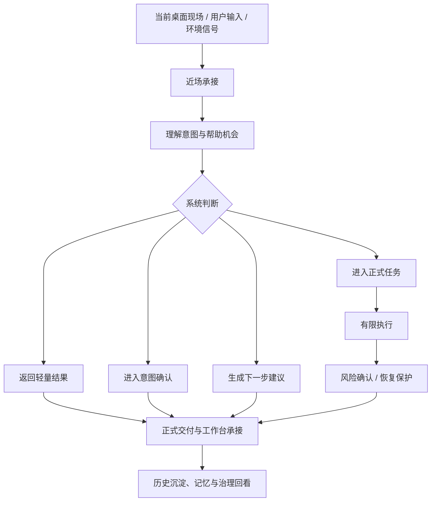

# CialloClaw 产品需求文档（PRD）

| 文档信息 | 内容                                       |
| -------- | ------------------------------------------ |
| 产品名称 | CialloClaw                                 |
| 文档版本 | v4.1                                       |
| 文档状态 | 正式版                                     |
| 创建日期 | 2026-04-18                                 |
| 目标平台 | Windows / macOS 桌面端（首发优先 Windows） |
| 产品定位 | 桌面常驻协作型 Agent                       |

------

## 1. 文档定位

本文件是 CialloClaw 在开工前使用的 **PRD**。

它用于统一回答以下问题：

- 为什么要做这个产品
- 这个产品服务哪些用户
- 用户会在什么场景下使用它
- 产品整体由哪些能力和模块构成
- 首版必须成立的最小闭环是什么
- 后续版本如何分阶段推进
- 如何判断产品是否成功
- 产品必须满足哪些体验、安全与信任底线

本文件定义的是产品层目标、范围、原则和总览结构，不承担接口、数据结构、状态枚举、页面组件和实现时序的详细定义；这些内容由后续协议、交互、模块和实现文档继续展开。

------

## 2. 项目背景

当前桌面端用户在真实工作流中使用 Agent 时，长期存在三类未被良好满足的问题。

### 问题 A：发起门槛高

用户通常需要先打开聊天窗口、进入某个工作区或组织 prompt，系统才开始理解需求。很多本可以顺手发起的帮助，最终因为路径太长而没有发生。

### 问题 B：上下文迁移成本高

用户需要手动复制网页、文档、报错、文件内容，再搬运到另一个产品中让 Agent 理解。帮助发生在任务现场之外，而不是围绕现场直接展开。

### 问题 C：执行不可信、长期价值不可见

很多 Agent 可以给建议，但用户不敢交出执行权，因为不清楚它会改什么、保存到哪里、失败后能否恢复、为什么需要授权。同时，系统即便记住了偏好，也常以黑箱方式存在，难以形成长期协作信任。

### 市场机会

当前聊天型 AI 擅长问答，但并不自然嵌入桌面任务现场；自动化工具能做事，但学习成本高、交互生硬；桌面小组件有入口，却缺乏持续协作能力。CialloClaw 希望填补这几类产品之间的空白：既不要求用户离开当前工作流，又能在可控边界内帮助理解、提醒、推进与有限执行。

### 产品机会

用户真正需要的，不是一个“必须专门去打开使用”的 AI 工具，而是一个“在当前桌面现场中顺手出现、顺手帮忙、不会乱来”的协作对象。只要产品能同时解决“发起门槛、上下文承接、结果可消费、边界可理解”四个问题，就有机会形成长期使用习惯。

------

## 3. 产品愿景与目标

### 3.1 产品愿景

打造一款 **面向真实桌面任务现场的常驻协作型 Agent 产品**，让用户在日常使用电脑时拥有一个：

- 不必先进入聊天窗口即可发起协作的桌面入口
- 能围绕当前页面、文件、文本、任务和异常现场提供帮助的上下文助手
- 能从“理解内容”推进到“给出下一步、生成草稿、推动事项”的协作对象
- 能在明确边界内执行有限动作，并让用户清楚知道影响范围、恢复方式与资源消耗的可信系统

### 3.2 产品定位

CialloClaw 不是一个以聊天框为中心的桌面 AI，而是一个：

- 以桌面现场为默认入口
- 以低打扰近场交互为主要承接方式
- 以任务推进为核心价值
- 以正式结果交付和可信治理建立长期信任
- 以长期记忆和阶段总结提升持续协作价值

### 3.3 产品目标

#### 目标一：降低桌面协作发起门槛

用户应能够通过低成本的近场动作，在当前桌面现场顺手发起一次协作，而不是先打开另一个产品再组织需求。

#### 目标二：让帮助直接发生在任务现场

系统应优先围绕当前页面、文本、文件、视频、错误信息、任务事项等上下文承接需求，减少复制粘贴、切换工具和解释背景的成本。

#### 目标三：从“回答问题”走向“推进任务”

CialloClaw 不只负责给出解释和总结，还应帮助用户明确下一步、生成草稿、打开资料、推动事项进入执行，并在必要时把未来安排转化为持续推进的正式任务。

#### 目标四：建立长期协作与可控执行信任

系统应逐步形成对用户偏好、习惯、任务脉络的长期理解，并通过风险分级、授权确认、日志、恢复点、资源消耗可见等能力，建立“敢用、敢托付一点事”的信任基础。

### 3.4 产品形态关键词

- 默认常驻，按需展开
- 语音优先，文字补充
- 上下文优先，聊天后置
- 轻量承接，正式交付
- 先提示，再确认，后执行
- 高风险动作必须可控
- 开箱即用优先

------

## 4. 目标用户与典型场景

### 4.1 目标用户

| 用户类型          | 核心特征                               | 主要痛点                       |
| ----------------- | -------------------------------------- | ------------------------------ |
| 知识工作者        | 高频切换网页、文档、表格、IM、会议材料 | 上下文搬运成本高，任务容易断掉 |
| 开发者 / 技术用户 | 频繁处理报错、日志、代码片段、命令结果 | 需要快速解释问题并推进下一步   |
| 项目型协作者      | 管理长期事项、临期事项和重复事项       | 任务记录多，推进和提醒不连续   |

### 4.2 典型使用场景

#### 场景一：文本现场理解

用户在网页、文档、聊天记录或代码片段中选中一段内容，希望立即获得解释、翻译、总结、提炼重点或改写建议。

#### 场景二：文件现场协作

用户将一个文件拖给 Agent，希望围绕该文件进行总结、分析、提炼、改写、生成草稿或得到下一步建议。

#### 场景三：错误与阻塞排查

用户遇到报错、异常页面、失败提示或阻塞信息时，希望快速知道原因、影响和下一步排查方向。

#### 场景四：即时表达需求

用户不想打字或无法精确组织 prompt，希望通过语音或一句话补充输入快速表达需求，让 Agent 先理解再推进。

#### 场景五：未来安排与任务推进

用户把未来要做的事情记录下来，希望系统在合适时机提醒、整理、给建议，并在必要时正式交给 Agent 推进。

#### 场景六：可信执行与结果回看

用户愿意让 Agent 做一点事，但前提是能看见边界、确认风险、知道结果在哪里、失败后如何恢复。

#### 场景七：长期协作

用户希望系统逐渐理解自己的习惯、偏好和工作节奏，但又要求这一切是可见、可纠正、可关闭的。

------

## 5. 产品设计原则

### 原则一：桌面现场优先

产品优先围绕当前页面、选中文本、拖入文件、错误信息、待办事项和当前桌面上下文承接需求，而不是把聊天窗口作为默认主入口。

### 原则二：低摩擦发起优先

用户应能够通过低成本的近场动作，在当前桌面现场顺手发起协作，而不是先打开另一个产品再组织需求。

### 原则三：语音优先，文字补充

语音是产品的重要表达方式，适合自然描述、连续补充和低门槛发起；文字输入保留为精确补充、修正和静默场景下的重要入口。

### 原则四：轻量承接优先，长结果正式分流

短结果、轻提示、状态反馈和意图确认优先在悬浮球附近承接；长文本、结构化结果和连续任务结果应进入正式交付层，而不是把近场交互做成重聊天界面。

### 原则五：任务推进优先于纯回答

产品不只负责解释、翻译和总结，还应帮助用户明确下一步、生成草稿、打开相关资料、推动事项进入执行，并在必要时形成持续推进的正式任务。

### 原则六：可信执行是成立条件

高风险动作必须可理解、可确认、可审计、可恢复。系统必须让用户知道会改什么、影响什么、花费什么、出了问题如何退出。

### 原则七：长期协作必须显性化

系统形成的长期记忆、偏好、阶段总结和用户画像必须对用户可见、可管理、可纠正，不能以黑箱方式存在。

------

## 6. 产品信息架构

从产品层视角，CialloClaw 由八个相互配合的模块构成。本章只定义产品级模块划分与范围边界，不进一步展开页面职责、具体交互动作或组件行为；这些细节应分别下放到交互设计、仪表盘设计和控制面板设计文档，避免形成双重真源。

| 产品模块 | 产品角色 | 本文档定义边界 |
| --- | --- | --- |
| 悬浮球 | 默认近场入口与在场锚点 | 只定义入口价值与存在意义，不定义具体交互动作 |
| 气泡区与轻量输入 | 近场反馈、补充输入与轻量承接层 | 只定义承接目标与分流原则，不定义页面细节 |
| 内容理解与任务推进能力 | 用户最先感知的核心价值层 | 只定义能力范围，不定义具体流程编排 |
| 仪表盘 | 统一工作台与持续协作承接面 | 只定义承接范围，不定义页面结构与模块排布 |
| 便签协作 | 未来安排与正式任务之间的桥接层 | 只定义产品语义，不定义列表组织与页面规则 |
| 镜子 | 长期理解、历史概要与记忆显性层 | 只定义长期协作价值，不定义展示形态 |
| 安全卫士 | 风险、授权、恢复与成本的解释与接管层 | 只定义信任职责，不定义详情页结构 |
| 控制面板 | 低频全局设置与策略入口 | 只定义设置范围，不定义设置项布局 |

这些模块共同构成产品总览层：近场入口负责发起与承接，能力层负责理解与推进，仪表盘负责持续查看与接管，治理层负责解释边界与恢复，设置层负责长期使用策略。

------

## 7. 核心产品闭环

从产品视角，CialloClaw 的核心运行逻辑是一条统一闭环：

### 7.1 闭环要求

- 用户的第一落点应是近场承接，而不是聊天页
- 产品对外应始终围绕任务组织，而不是围绕聊天轮次组织
- 短结果应能在当前现场附近消费，长结果必须可回看、可打开、可继续使用
- 执行前的边界解释和执行后的结果说明同等重要
- 记忆沉淀必须服务长期协作，而不是变成黑箱历史记录

### 7.2 用户必须感受到的产品结果

- 它总是在，但不烦
- 我不必先去打开它，它就在当前任务附近
- 它能看懂我正在处理的对象，不必让我重复解释
- 它不只是回答，还会帮我推进下一步
- 它做事前会让我明白边界，做事后有结果、有记录、能回退

------

## 8. 功能能力版图

本章回答“产品需要具备哪些能力与模块”，不再承担版本优先级说明；阶段优先级统一以下文第 10 章为准。

### 8.1 用户需求与功能映射

| 用户需求                                       | 对应能力                               |
| ---------------------------------------------- | -------------------------------------- |
| 在当前页面、文本、文件上快速获得帮助           | 总结、翻译、解释、重点提炼             |
| 遇到报错、阻塞或异常时获得原因和下一步建议     | 错误分析、阻塞解释、下一步建议         |
| 通过轻动作顺手发起协作                         | 近场入口、自然表达、当前对象承接       |
| 获得短反馈并在需要时进入正式结果               | 气泡区、轻量输入、正式交付层           |
| 把某件事项正式交给 Agent 推进                  | 便签协作、任务状态、任务详情           |
| 了解当前任务做到哪一步、是否卡住、是否需要授权 | 仪表盘、任务状态、安全摘要             |
| 希望系统越来越懂自己，但又不想被黑箱记住       | 镜子、历史概要、记忆管理               |
| 希望清楚知道系统会改什么、影响什么、能不能撤回 | 安全卫士、风险分级、恢复点、审计记录   |
| 希望能启用或关闭主动协助、记忆、预算等全局行为 | 控制面板、记忆策略、主动协助、预算设置 |
| 希望系统支持更多自动化和扩展能力               | 自动化、模型路由、插件 / Skills        |

### 8.2 关键功能模块

| 功能模块           | 核心功能                                          |
| ------------------ | ------------------------------------------------- |
| 悬浮球             | 常驻入口、状态提示、近场发起与对象承接           |
| 气泡区与轻量输入   | 短结果、轻提示、补充输入、意图确认                |
| 内容理解           | 总结、翻译、解释、重点提炼、错误分析              |
| 任务推进           | 下一步建议、草稿生成、阻塞解释、资料入口          |
| 仪表盘首页         | 当前焦点、任务总览、信任摘要、召回入口            |
| 任务状态           | 进行中 / 等待中 / 异常中 / 已结束任务查看与管理   |
| 便签协作           | 近期要做、后续安排、重复事项、已结束事项          |
| 镜子               | 历史概要、阶段总结、用户画像、记忆管理            |
| 安全卫士           | 风险分级、待确认项、授权记录、恢复与费用          |
| 控制面板           | 全局行为、记忆策略、主动协助、预算与默认结果位置  |
| 自动化与扩展       | 周期巡检、定时任务、插件 / Skills、模型路由       |
| 高阶理解与能力扩展 | 视频总结、长内容理解、多模型协同                  |

### 8.3 范围边界

本 PRD 关注的是产品主链路和用户价值成立，不把以下内容作为首版产品成立条件：

- 面向开发者的复杂插件生态
- 多模型路由的高级配置能力
- 跨设备同步和团队协作能力
- 需要高复杂度治理和基础设施支撑的规模化能力

这些方向应在核心闭环稳定后，再纳入后续阶段规划。

------

## 9. 关键体验要求

本章定义的是产品级体验目标和首版必须保证的体验闭环，不定义具体手势、按钮行为、页面状态机或组件交互细节。

### 9.1 近场发起体验

产品必须让用户能够在当前桌面现场低成本发起协作，而不是先进入主界面或聊天窗口。

具体要求：

- 首版必须具备稳定的近场发起入口，而不是以聊天窗口作为默认入口
- 首版必须至少覆盖一种自然表达入口、一种围绕当前对象的入口和一种轻量补充入口
- 发起过程应尽量减少用户重新组织需求和搬运上下文的成本
- 入口设计应优先服务“顺手发起协作”，而不是增加新的操作负担

### 9.2 近场承接体验

近场承接层必须足够轻，能够快速反馈当前状态，但不能演化为重聊天界面。

具体要求：

- 能快速表达系统当前状态和结果方向
- 能承接最小必要的确认、修正和补充输入
- 能承接短结果，但不承担冗长历史和复杂管理任务
- 当结果超出近场承载范围时，必须进入正式交付层继续承接

### 9.3 仪表盘体验

仪表盘的职责不是展示功能列表，而是帮助用户快速判断现在最值得关注的事情，并进入正确的接管入口。

具体要求：

- 用户打开仪表盘后，应快速判断当前最值得关注的事
- 仪表盘必须同时承接当前任务、未来安排、治理信息和长期协作信息
- 仪表盘中的不同信息层必须语义清晰，避免互相混淆
- 仪表盘应优先帮助用户接管和继续推进，而不是堆叠功能入口

### 9.4 事项到任务的桥接体验

产品必须让用户清楚区分“未来安排”和“已进入推进的任务”，并让二者之间的转换自然成立。

具体要求：

- 未来安排与正式任务必须保持明确区分
- 产品应支持围绕事项进行提醒、建议和转交给 Agent 的桥接
- 事项在被转交前后，应保持语义清晰，不与正式任务混为一体
- 被转交后，应形成可持续查看与推进的任务体验

### 9.5 长期协作体验

长期协作价值必须被用户感知，而不是只停留在系统内部。

具体要求：

- 用户应能理解系统沉淀了哪些长期价值
- 长期协作信息应帮助用户回看历史、理解偏好和复用经验
- 记忆相关内容必须可见、可理解、可管理，而不是黑箱存在

### 9.6 信任与治理体验

用户不仅要知道 Agent 在做什么，还要知道它会影响什么、何时需要确认、出问题后如何退出。

具体要求：

- 用户必须能理解当前是否存在待确认动作和风险边界
- 产品必须让用户看见影响范围、异常情况、恢复能力和资源消耗
- 高风险动作必须体现“先理解边界，再决定是否继续”的治理体验

### 9.7 设置与策略体验

设置体系必须服务长期使用，但不能干扰主链路。

具体要求：

- 设置体系应服务长期使用，而不是抢占主流程
- 用户应能理解并调整入口策略、记忆策略、自动化策略、预算与数据维护策略
- 风险较高的设置必须清楚说明影响范围和生效方式

------

## 10. 阶段规划与首版边界

本章回答“这些能力按什么顺序进入版本计划”，不再重复定义模块本身。

### 10.1 P0：产品最小闭环

P0 不是最少功能，而是 **必须能让产品成立** 的最小闭环。P0 必须实现：

- 自然的桌面近场入口
- 至少几类高频理解能力的真实承接
- 从近场到正式结果的结果分流
- 能看见当前任务与最小工作台状态
- 至少一条可信执行链路
- 至少一种未来安排到正式任务的桥接方式

#### 10.1.1 首版必须包含的范围

首版必须至少覆盖以下产品范围：

- **入口层成立：** 首版至少形成一种自然表达入口、一种轻量补充入口和一种围绕当前对象的稳定承接入口
- **高频理解成立：** 总结、解释、翻译、错误分析、下一步建议、草稿生成中，至少覆盖最常见的高频办公与信息处理场景
- **结果承接成立：** 短结果可在近场消费，长结果可进入正式交付层继续查看、打开或复用
- **任务承接成立：** 用户能看到当前任务状态、等待原因、结果入口和最小安全摘要
- **治理闭环成立：** 至少一种高风险动作在首版中具备边界解释、确认、结果回看与恢复说明
- **未来安排桥接成立：** 至少一种事项来源能被整理、建议并升级为正式推进任务

#### 10.1.2 首版明确不包含的范围

以下内容不作为首版成立条件：

- 面向开发者的复杂插件生态
- 多模型路由的高级配置与复杂策略切换
- 跨设备同步、云端协同和团队级共享能力
- 大规模自治执行和长链路无人值守自动化
- 完整的个性化画像管理后台和复杂记忆治理体系
- 依赖高复杂基础设施的规模化能力与生态能力

这些方向只有在核心闭环稳定之后，才进入后续版本规划。

#### 10.1.3 首版完成定义

首版做到以下结果时，才可认为 P0 闭环成立：

- 用户能在真实桌面场景下，通过近场入口完成至少一轮“发起 → 获得结果 → 继续推进或结束”的完整协作
- 至少一种短结果和至少一种长结果都能被正确承接，而不是只停留在近场提示
- 用户能在工作台中看见当前任务、最小安全摘要、结果入口和最小历史沉淀
- 至少一条高风险动作链路具备确认、记录和恢复说明
- 用户能够清楚区分“未来安排”“正在推进的任务”“正式结果”和“风险确认”四类对象

#### 10.1.4 首版关键边界

首版必须明确守住以下产品边界：

- 首版不是一个以聊天窗口为主入口的聊天产品
- 首版不是一个默认全自动、可无限制代替用户执行动作的自治系统
- 首版不是一个复杂插件平台、多模型控制台或团队协同平台
- 首版的长期记忆必须可见、可理解、可关闭，不能以黑箱方式主导协作
- 首版的高风险动作必须经过用户理解和确认，不能以“聪明”为理由绕过边界

### 10.2 P1：持续使用体验

P1 解决“能用”之后的“能持续用”，重点包括：

- 巡检和提醒完整化
- 任务详情、安全详情、恢复查看和镜子增强
- 设置中心完善
- 成本、预算、降级和长期协作可见性增强

### 10.3 P2：更自然、更智能、更低打扰

P2 重点提升体验自然度和帮助时机质量，包括：

- 更聪明的主动推荐
- 更细腻的近场动画和轻提示
- 更强的首页焦点与召回能力
- 更复杂的内容理解和生成能力

### 10.4 P3：生态扩展与规模化能力

P3 重点扩展能力边界，包括：

- 多模型切换与路由
- 社区 Skills 与插件生态
- 感知包扩展
- 多设备协作、同步和更广泛的长期协作场景

------

## 11. 状态表达与结果承接原则

### 11.1 用户可理解的状态表达

从产品展示层面，任务状态应优先使用用户能直观理解的语言，而不是直接暴露底层实现状态：

- **进行中：** 正在进行、接近完成
- **等待中：** 等待授权、等待补充信息、等待外部条件、暂停中
- **异常中：** 失败、阻塞、执行异常
- **已结束：** 已完成、已取消、已结束未完成

页面表达的重点不是给状态起名，而是让用户快速回答三个问题：

- 现在进行到哪一步了
- 为什么停住了
- 我下一步该做什么

### 11.2 结果承接原则

- 短结果优先在近场承接
- 长文本优先进入文档或正式结果页
- 文件类结果应支持打开或定位
- 连续任务和失败任务应进入任务详情承接
- 失败、中断和高风险结果必须附带结构化说明与恢复入口

### 11.3 风险等级表达

- **绿灯：** 低风险，记录即可
- **黄灯：** 会修改内容或改变环境，先解释影响范围，再给确认入口
- **红灯：** 删除、外发、越界、不可逆或涉及关键身份与关键文件的动作，必须显式人工确认

------

## 12. 成功标准与效果评估

### 12.1 产品成功标准

从最终产品视角，CialloClaw 需要稳定达成以下主观结果：

- 它总是在，但不烦
- 我不必先去打开它，它就在当前任务附近
- 它能看懂我正在做什么，不必让我重复解释
- 它不只是说建议，还会帮我推进下一步
- 它做事之前会让我明白边界
- 我能知道它做了什么、花了什么、出了问题怎么退
- 它越来越像一个熟悉我工作方式的协作者

### 12.2 核心指标

| 目标维度   | 代表指标                                             | 判断方向               |
| ---------- | ---------------------------------------------------- | ---------------------- |
| 发起效率   | 文本选中后继续协作率、文件拖拽发起率、长按语音发起率 | 验证入口是否自然       |
| 上下文效率 | 围绕当前对象直接完成的比例、补充背景次数下降         | 验证是否减少上下文搬运 |
| 推进效率   | 任务发起率、任务推进率、便签转任务率                 | 验证是否从回答走向推进 |
| 信任治理   | 高风险确认处理率、恢复点查看率、成本查看率           | 验证是否建立边界与信任 |
| 长期价值   | 镜子回看率、记忆认可度、个性化建议接受率             | 验证长期协作是否成立   |

### 12.3 首版验收标准

首版验收时，至少应满足以下标准：

- 至少一类近场发起方式能在真实桌面场景中稳定触发完整协作链路
- 至少一类短结果和一类长结果都能被正确承接并继续消费
- 工作台能够承接当前任务、安全摘要、结果入口和最小历史沉淀
- 至少一条高风险动作链路具备可理解、可确认、可回看的治理过程
- 用户能够清楚区分未来安排、正式任务、正式交付和风险确认四类产品对象

------

## 13. 非功能性要求

### 13.1 低打扰与可接近性

- 产品默认常驻，但不持续抢占注意力
- 主动提示必须克制，避免高频打断
- 用户应随时能重新接近 Agent，而不需要重新打开复杂工作区

### 13.2 性能与反馈

- 悬浮球和近场承接必须保持轻量、顺滑、快速可触达
- 用户发起后应尽快获得短反馈、处理中状态或意图确认
- 长任务必须持续反馈当前状态，不能静默悬空
- 用户打开仪表盘后，应在短时间内定位当前最重要的信息

### 13.3 安全与恢复

- 高风险动作必须进入确认链路
- 系统必须明确说明会改什么、影响什么、能否撤回
- 重要动作必须可查、可追踪、可回看
- 中断和失败后必须提供恢复或回退信息

### 13.4 成本透明

- 当前任务与当日累计资源消耗必须可见
- 预算、限制与降级策略必须对用户可理解

### 13.5 记忆可控

- 用户必须能查看、删除、关闭或纠正长期记忆
- 长期记忆不应以黑箱形式影响用户决策

### 13.6 平台体验

- 产品应适应桌面多窗口、多任务与边工作边协作的使用方式
- 桌面入口、结果承接和工作台之间的切换应自然连续

------

## 14. 产品术语说明

| 术语     | 定义                                                 |
| -------- | ---------------------------------------------------- |
| 悬浮球   | 桌面常驻入口，用户接近 CialloClaw 的默认近场锚点     |
| 气泡区   | 当前任务现场附近的短结果、轻提示与状态反馈承接层     |
| 轻量输入 | 围绕当前对象的一句话补充输入与修正入口               |
| 仪表盘   | 承载当前焦点、任务、未来安排、镜子与安全的统一工作台 |
| 控制面板 | 低频全局设置与系统策略入口                           |
| 任务     | 已经被 Agent 接手并正在推进的工作                    |
| 便签协作 | 未来安排、周期事项和可转交给 Agent 的异步协作入口    |
| 镜子     | 系统对历史、偏好、总结和长期理解的显性表达层         |
| 安全卫士 | 风险、授权、恢复、审计、成本的统一解释与接管层       |
| 正式交付 | 文档、结果页、任务详情、文件等可继续消费和回看的结果 |

------

## 15. 一句话结论

CialloClaw 的目标不是做一个更会聊天的桌面 AI，而是做一个 **能在当前任务现场被顺手发起、能围绕上下文理解并推进任务、能把结果正式交付、能把风险和恢复讲清楚、并能逐步形成长期协作价值的桌面常驻 Agent**。
